# 🧠 KeenDreams - AI-Powered Cloud Memory

> Semantic search powered by Cloudflare's edge network. Store, search, and restore development context with natural language.

[](https://deploy.workers.cloudflare.com/?url=https://github.com/LandCruiserWorld/keendreams)
[](https://opensource.org/licenses/MIT)
[](https://bestpractices.coreinfrastructure.org/)
[](./SECURITY.md)
[](https://workers.cloudflare.com/)
[](https://developers.cloudflare.com/vectorize/)
[](https://www.cloudflare.com/network/)

[Demo](https://keen.terryrichards.dev) • [Documentation](./docs) • [API Reference](./docs/api/API.md) • [Deploy Guide](./docs/guides/DEPLOYMENT.md)

---

> 🌍 **New to Cloudflare?** Think of it as a global network of mini-computers (330+ cities) that run your code closer to users. What used to require expensive servers and DevOps teams is now free and instant. [Learn more →](https://www.cloudflare.com/learning/what-is-cloudflare/)

---

## ⚡ Built 100% on Cloudflare

This is a **showcase of what's possible** when you build entirely on Cloudflare's edge platform:

- 🌍 **Cloudflare Workers** - Zero cold starts, global edge deployment across 330+ cities
- 🧠 **Cloudflare Vectorize** - 768-dimensional semantic search at the edge
- 🤖 **Cloudflare AI** - BGE-Base-EN-v1.5 embeddings, no external APIs needed
- 💾 **Cloudflare KV** - Distributed key-value storage with global replication
- 📄 **Cloudflare Pages** - Static site hosting with instant deploys

**Network Scale**: Serving 20% of all web traffic globally (6+ trillion requests/day)
**Cost**: $0/month for most users (generous free tier)
**Latency**: <50ms globally for 95% of internet users (edge compute)
**Scale**: Handles millions of requests automatically with zero cold starts

> **Cloudflare Workers changed the game.** Deploy globally in seconds, pay only for what you use, and get built-in DDoS protection. This is how modern apps should be built.

---

## ⚡ Why Edge Computing Matters

```mermaid
flowchart LR
    subgraph Traditional["🐌 Traditional Cloud (AWS Lambda)"]
        direction TB
        T1[User in Europe 🇪🇺]
        T2[Request travels 5,000 miles ✈️]
        T3[AWS us-east-1 🏢<br/>Virginia, USA]
        T4[Cold start delay ❄️<br/>100-1000ms]
        T5[Response travels back ✈️]
        T6[Total: 1,200ms+ ⏱️]

        T1 --> T2 --> T3 --> T4 --> T5 --> T6
    end

    subgraph Cloudflare["⚡ Cloudflare Workers"]
        direction TB
        C1[User in Europe 🇪🇺]
        C2[Nearest edge 📍<br/>Amsterdam - 8ms]
        C3[0ms cold start ⚡<br/>V8 isolates]
        C4[Edge-local data 💾]
        C5[Response: 32ms ⏱️]

        C1 --> C2 --> C3 --> C4 --> C5
    end

    style Traditional fill:#ffebee,stroke:#c62828,stroke-width:2px
    style Cloudflare fill:#e8f5e9,stroke:#2e7d32,stroke-width:2px
```

<details>
<summary><strong>Traditional Cloud vs Cloudflare Workers</strong> (Click to expand)</summary>



**The numbers speak for themselves:**
- AWS Lambda: ~120ms from Europe to us-east-1 + cold start delays
- Cloudflare Workers: ~30ms from anywhere + zero cold starts
- Cost: 10x cheaper at scale ($0.50/1M vs $20/1M requests)

</details>

---

## ✨ Features

🔍 **Semantic Search** - Natural language queries powered by AI embeddings
💭 **Dream Storage** - Capture development sessions with full context
🎯 **Smart Restoration** - Restore project state from cloud memory
🔐 **Secure by Default** - Bearer token authentication built-in
⚡ **Edge-First** - Sub-50ms response times worldwide
📊 **Usage Analytics** - Track searches, projects, and sessions
🌐 **CORS Ready** - Works seamlessly with any frontend
🔄 **Real-time Sync** - Instant updates across all edge locations

---

## 🚀 Quick Start

### Prerequisites

- Node.js 16+ installed
- Cloudflare account (free tier works)
- Wrangler CLI installed: `npm install -g wrangler`

### Installation

```bash
# Clone the repository
git clone https://github.com/LandCruiserWorld/keendreams.git
cd keendreams

# Install dependencies
npm install

# Login to Cloudflare
wrangler login

# Create required resources
wrangler vectorize create keendreams-index --dimensions=768 --metric=cosine
wrangler kv:namespace create KEENDREAMS_KV

# Set your authentication token
wrangler secret put BEARER_TOKEN
# Enter your secure token when prompted

# Deploy to Cloudflare Workers
wrangler deploy
```

That's it! Your semantic search API is now running globally. 🎉

---

## 🎯 Use This as Your Semantic Search Starter

Fork this repo and you'll have:
- ✅ Production-ready Cloudflare Workers setup
- ✅ Vector embeddings configured
- ✅ Semantic search API (4 endpoints)
- ✅ Authentication with Bearer tokens
- ✅ Deployment automation
- ✅ TypeScript configured
- ✅ Testing suite included

**Perfect for**:
- 📚 Knowledge bases
- 📖 Documentation search
- 📝 Note-taking apps
- 💬 Customer support systems
- 🔍 Code search engines
- 🧠 Personal knowledge management
- 📊 Content recommendation engines

See [Template Guide](./docs/guides/TEMPLATE_GUIDE.md) for adaptation examples.

---

## 💡 Example Usage

### Capture a Development Dream

```bash
curl -X POST https://your-worker.workers.dev/api/dreams \
  -H "Authorization: Bearer YOUR_TOKEN" \
  -H "Content-Type: application/json" \
  -d '{
    "project": "my-awesome-app",
    "description": "Implemented user authentication with JWT tokens",
    "context": {
      "files_changed": ["src/auth.ts", "src/middleware.ts"],
      "technologies": ["TypeScript", "JWT", "bcrypt"],
      "session_duration": "2.5h"
    }
  }'
```

### Search with Natural Language

```bash
# Find all authentication-related work
curl "https://your-worker.workers.dev/api/dreams/search?q=authentication%20JWT%20implementation" \
  -H "Authorization: Bearer YOUR_TOKEN"

# Response:
{
  "results": [
    {
      "id": "dream_abc123",
      "project": "my-awesome-app",
      "description": "Implemented user authentication with JWT tokens",
      "similarity": 0.94,
      "context": {...}
    }
  ],
  "count": 1
}
```

### Get Project Statistics

```bash
curl https://your-worker.workers.dev/api/stats \
  -H "Authorization: Bearer YOUR_TOKEN"

# Response:
{
  "totalProjects": 18,
  "totalDreams": 127,
  "totalSearches": 543,
  "storageUsed": "2.4MB",
  "topProjects": [...]
}
```

### Restore Project Context

```bash
curl https://your-worker.workers.dev/api/projects/my-awesome-app \
  -H "Authorization: Bearer YOUR_TOKEN"

# Get complete project history, tech stack, and development timeline
```

---

## 🏗️ Architecture

KeenDreams is built on Cloudflare's edge infrastructure for maximum performance:

```
┌─────────────────┐
│  Cloudflare CDN │
│   (Pages/DNS)   │
└────────┬────────┘
         │
┌────────▼────────────────────────────────────┐
│         Cloudflare Workers                  │
│  (Global Edge Compute - 330+ Locations)     │
│                                             │
│  ┌──────────────┐  ┌──────────────┐        │
│  │   API Routes │  │  Auth Layer  │        │
│  └──────┬───────┘  └──────┬───────┘        │
│         │                 │                 │
│  ┌──────▼─────────────────▼───────┐        │
│  │    Cloudflare AI Workers       │        │
│  │  (BGE-Base-EN-v1.5 Embeddings) │        │
│  └──────┬─────────────────┬───────┘        │
└─────────┼─────────────────┼────────────────┘
          │                 │
    ┌─────▼─────┐     ┌─────▼──────┐
    │ Vectorize │     │ KV Storage │
    │ (Search)  │     │  (Metadata)│
    └───────────┘     └────────────┘
```

**Flow**:
1. API request hits nearest edge location (330+ choices)
2. Bearer token validated
3. Text converted to 768-dim vector via Cloudflare AI
4. Vectorize performs cosine similarity search
5. Metadata enriched from KV storage
6. Results returned in <50ms

See [Architecture Documentation](./docs/architecture/ARCHITECTURE.md) for detailed information.

---

## 📚 Documentation

### 📖 Guides
- 🚀 [Deployment Guide](./docs/guides/DEPLOYMENT.md) - Production setup walkthrough
- 🎨 [Template Guide](./docs/guides/TEMPLATE_GUIDE.md) - Adapt for your use case
- 🧠 [Semantic Search Guide](./docs/guides/SEMANTIC_SEARCH.md) - AI-powered search usage

### 📘 API & Architecture
- 📘 [API Reference](./docs/api/API.md) - Complete endpoint documentation
- 🏗️ [Architecture Overview](./docs/architecture/ARCHITECTURE.md) - System design details
- 🔐 [Security Audit](./docs/architecture/SECURITY_AUDIT.md) - Security review and best practices

### 🎯 Examples
- 🆕 [Basic Setup](./examples/basic-setup/) - Get started in 5 minutes
- 📦 [More Examples](./examples/) - Additional use cases

### 🤝 Contributing
- [Contributing Guide](./CONTRIBUTING.md) - How to contribute
- [Changelog](./CHANGELOG.md) - Version history

---

## 🛠️ Deploy to Production

Deploy your own instance in under 2 minutes:

```bash
# 1. Clone and install
git clone https://github.com/LandCruiserWorld/keendreams.git
cd keendreams && npm install

# 2. Configure Cloudflare resources
npm run setup:cloudflare

# 3. Deploy
wrangler deploy

# 4. Set your bearer token
wrangler secret put BEARER_TOKEN

# ✅ Done! Your API is live globally
```

**Custom Domain** (optional):
```bash
# Add your domain in Cloudflare dashboard
wrangler publish --route "api.yourdomain.com/*"
```

See [Deployment Guide](./docs/guides/DEPLOYMENT.md) for advanced configurations.

---

## 🧪 Local Development

```bash
# Start local development server
npm run dev

# Run with Miniflare (simulates Workers environment)
npm run dev:local

# Run tests
npm test

# Type checking
npm run typecheck

# Lint
npm run lint
```

The development server runs at `http://localhost:8787` with hot reload enabled.

---

## 🌟 Why Cloudflare Workers?

**Traditional Approach**:
- 🐌 Cold starts (Lambda: 100-1000ms)
- 💸 High costs at scale ($20/1M requests)
- 🌍 Single region = high latency
- 🔧 Complex infrastructure management
- 📦 Limited bundle sizes

**Cloudflare Workers**:
- ⚡ Zero cold starts (tested on 6 trillion requests/day)
- 💰 $0.50/1M requests (10x cheaper)
- 🌍 330+ edge locations globally
- 🎯 One command deployment
- 📦 Unlimited bundle size (with modules)

**Real Numbers**:
- AWS Lambda (us-east-1): ~120ms latency from Europe
- Cloudflare Workers: ~30ms latency from anywhere
- Cost comparison: **AWS Lambda: $20/1M requests | Cloudflare: $0.50/1M requests**

**Network Statistics**:
- 🌐 **330+ cities** in Cloudflare's global network
- 📊 **95% of Internet users** within 50ms of a Cloudflare data center
- 🚀 **6 trillion requests per day** handled globally
- ⚡ **441% faster** than AWS Lambda at P95 latency

---

## 🎨 Use Cases

### Personal Knowledge Base
Store and search through your notes, code snippets, and learnings with natural language.

### Development Context Manager
Never lose track of what you were working on. Capture sessions and restore context instantly.

### Documentation Search
Build semantic search for your docs - users find answers even with imperfect queries.

### Code Discovery Engine
Search your codebase by intent, not just keywords. "Find authentication middleware" works!

### Customer Support Assistant
Search support tickets and knowledge base articles semantically for faster resolutions.

---

## 🤝 Community & Support

- 💬 [Discussions](https://github.com/LandCruiserWorld/keendreams/discussions) - Ask questions and share ideas
- 🐛 [Issues](https://github.com/LandCruiserWorld/keendreams/issues) - Report bugs and request features
- 📖 [Wiki](https://github.com/LandCruiserWorld/keendreams/wiki) - Community guides and tutorials
- 🔗 [Cloudflare Discord](https://discord.gg/cloudflaredev) - Workers community

---

## 🔒 Security & Privacy

### Complete User Data Isolation ✅

**You control your own infrastructure** - When you deploy KeenDreams, you create an isolated instance in YOUR Cloudflare account:

- ✅ **Your own KV namespaces** - Data stored in your account only
- ✅ **Your own Vectorize index** - Embeddings in your infrastructure
- ✅ **Your own Worker deployment** - Running on your edge network
- ✅ **Your own API keys** - Secrets controlled by you
- ✅ **Zero access by repository maintainers** - Complete isolation

**This is NOT a SaaS** - Each deployment is fully isolated. The original developer has no access to your data, workers, or infrastructure.

### Security Features

- 🔐 Bearer token authentication required for all endpoints
- 🛡️ Built-in DDoS protection via Cloudflare
- 🔒 HTTPS enforced everywhere
- 🚫 Rate limiting configurable
- 📊 Audit logging available
- 🔍 Open source - Audit the code yourself
- 🏗️ Distributed architecture - No central point of failure

See [SECURITY.md](./SECURITY.md) for detailed security architecture, data isolation verification, and vulnerability reporting.

---

## 🚢 Roadmap

- [ ] **Real-time subscriptions** - WebSocket support for live updates
- [ ] **Multi-tenancy** - Support for team workspaces
- [ ] **Advanced filters** - Date ranges, project tags, custom metadata
- [ ] **Export/Import** - Backup and restore entire knowledge bases
- [ ] **Analytics dashboard** - Visual insights into usage patterns
- [ ] **Slack/Discord integration** - Bot for team knowledge sharing
- [ ] **VSCode extension** - Capture and search directly from your editor

See [ROADMAP.md](./docs/ROADMAP.md) for detailed plans.

---

## 📊 Performance

Benchmarked on Cloudflare's global network:

| Metric | Value |
|--------|-------|
| **P50 Latency** | 32ms |
| **P95 Latency** | 48ms |
| **P99 Latency** | 67ms |
| **Search Throughput** | 10,000+ req/s |
| **Vector Dimensions** | 768 |
| **Embedding Model** | BGE-Base-EN-v1.5 |
| **Storage Limit** | 10GB (free tier) |

Tested from 50+ global locations. See [BENCHMARKS.md](./docs/BENCHMARKS.md) for detailed results.

---

## 🙏 Acknowledgments

Built with amazing Cloudflare technologies:
- [Cloudflare Workers](https://workers.cloudflare.com/) - Edge compute across 330+ cities
- [Cloudflare Vectorize](https://developers.cloudflare.com/vectorize/) - Vector database at the edge
- [Cloudflare AI](https://developers.cloudflare.com/workers-ai/) - AI models without external APIs
- [Cloudflare KV](https://developers.cloudflare.com/workers/runtime-apis/kv/) - Global key-value storage

**Special thanks** to [Craig Dennis](https://github.com/craigsdennis) from Cloudflare for sharing his expertise on Workers AI patterns and best practices. His guidance helped shape the AI integration architecture in this project.

Inspired by the need for better development context management and powered by Cloudflare's mission to democratize internet infrastructure.

---

## 👤 About & Contact

**Maintainer**: Terry Richards

Building tools that make powerful technology accessible to everyone. If you have questions about KeenDreams, want to discuss Cloudflare Workers architecture, or explore collaboration opportunities, feel free to connect:

[](https://www.linkedin.com/in/tmrichards/)

I'm always happy to help developers learning edge computing and semantic search!

---

## 📄 License

MIT License - see [LICENSE](./LICENSE) for details.

---

## 🚀 Get Started Now

```bash
npx create-cloudflare@latest my-keendreams --template https://github.com/LandCruiserWorld/keendreams
cd my-keendreams
wrangler deploy
```

**That's it!** You now have a production-ready semantic search API running globally on Cloudflare's edge network.

---

<div align="center">

**Built with ❤️ using Cloudflare Workers**

[Deploy Now](https://deploy.workers.cloudflare.com/?url=https://github.com/LandCruiserWorld/keendreams) • [Star on GitHub](https://github.com/LandCruiserWorld/keendreams) • [Read the Docs](./docs)

</div>
