# 💭 KeenDreams - AI Vectorized Cloud Memory

<div align="center">


</div>

> Vector semantic search at the edge powered by Cloudflare Workers. Store, search, and restore development context with natural language. 768-dimensional embeddings running across 330+ cities globally. Your code sessions, captured and ready to explore.

[](https://deploy.workers.cloudflare.com/?url=https://github.com/LandCruiserWorld/keendreams)
[](https://opensource.org/licenses/MIT)
[](https://bestpractices.coreinfrastructure.org/)
[](./SECURITY.md)
[](https://workers.cloudflare.com/)
[](https://developers.cloudflare.com/vectorize/)
[](https://www.cloudflare.com/network/)

[Documentation](./docs) • [API Reference](./docs/api/API.md) • [Deploy Guide](./docs/guides/DEPLOYMENT.md)

---

<div align="center">


*Cloudflare's global edge network spanning 330+ cities across 125+ countries*

</div>

> 🌍 **Built on Cloudflare's Global Network**: 330+ cities serving 20% of all web traffic (6 trillion requests/day). Enterprise infrastructure that used to cost thousands - now free to deploy. 95% of Internet users within 50ms. [What is Cloudflare? →](https://www.cloudflare.com/learning/what-is-cloudflare/)

---

## ⚡ Built 100% on Cloudflare

This is a **showcase of what's possible** when you build entirely on Cloudflare's edge platform:

<div align="center">


*Cloudflare's complete developer platform ecosystem powering KeenDreams*

</div>

- 🌍 **Cloudflare Workers** - Zero cold starts, global edge deployment across 330+ cities
- 💭 **Cloudflare Vectorize** - 768-dimensional semantic search at the edge
- 🥔 **Cloudflare AI** - BGE-Base-EN-v1.5 embeddings, no external APIs needed
- 🥦 **Cloudflare KV** - Distributed key-value storage with global replication
- 📄 **Cloudflare Pages** - Static site hosting with instant deploys

<details>
<summary><strong>Network Statistics</strong> (Click to expand)</summary>

- 🍅 **6 trillion requests/day** - Handles scale you can't outgrow
- 🌍 **330+ cities globally** - Edge compute everywhere
- ⚡ **95% of Internet users** within 50ms latency
- 💰 **$0 egress fees** - Unlike AWS ($0.09/GB), Cloudflare charges nothing for bandwidth
- 🚀 **0ms cold starts** - Tested on production traffic at massive scale

</details>

**Cost Structure** (In Terms of Dreams):
- **Free Tier**: 100,000 requests/day (3M/month) + 10GB storage
  - **In Dream Terms**: Store ~500,000 development sessions + search them 3 million times/month
  - **Real-World Usage**:
    - Solo developer: 5 dreams/day = 150/month → **Will never hit limits** ✅
    - Small team (10 devs): 50 dreams/day = 1,500/month → **Still free** ✅
    - Growing team (50 devs): 250 dreams/day = 7,500/month → **Still free** ✅
    - Even 100-person eng team: ~1,000 dreams/day → **Free for years** ✅
  - **Search Operations**: 3M/month = 100,000/day = enough for 1,000+ developers searching constantly
- **Storage Reality**: 10GB = ~500,000 dreams (avg 20KB each with embeddings)
  - **Timeline**: At 10 dreams/day, takes **137 years** to fill 10GB ⏰
- **Paid Tier**: Only $5/month for 10M additional requests (if you somehow exceed free tier)
  - **No egress fees** = no surprise bills (AWS charges $0.09/GB for data transfer)
  - **Predictable costs** = sleep well knowing viral traffic won't bankrupt you
- **Compare**: AWS Lambda + DynamoDB + Pinecone = $50-150/month for equivalent performance

> **This democratizes enterprise infrastructure.** What Fortune 500 companies spent millions on is now free for students, hobbyists, and small businesses. Even moderate commercial use cases stay on the free tier. That's Cloudflare's mission: help build a better Internet.

---

## ⚡ Why Edge Computing Matters

```mermaid
flowchart LR
    subgraph Traditional["🐌 Traditional Cloud (AWS Lambda)"]
        direction TB
        T1[User in Europe 🇪🇺]
        T2[Request travels 5,000 miles ✈️]
        T3[AWS us-east-1 🏢<br/>Virginia, USA]
        T4[Cold start delay ❄️<br/>100-1000ms]
        T5[Response travels back ✈️]
        T6[Total: 1,200ms+ ⏱️]

        T1 --> T2 --> T3 --> T4 --> T5 --> T6
    end

    subgraph Cloudflare["⚡ Cloudflare Workers"]
        direction TB
        C1[User in Europe 🇪🇺]
        C2[Nearest edge 📍<br/>Amsterdam - 8ms]
        C3[0ms cold start ⚡<br/>V8 isolates]
        C4[Edge-local data 🥦]
        C5[Response: 32ms ⏱️]

        C1 --> C2 --> C3 --> C4 --> C5
    end

    style Traditional fill:#ffebee,stroke:#c62828,stroke-width:2px
    style Cloudflare fill:#e8f5e9,stroke:#2e7d32,stroke-width:2px
```

<details>
<summary><strong>Traditional Cloud vs Cloudflare Workers</strong> (Click to expand)</summary>



**The numbers speak for themselves:**
- AWS Lambda: ~120ms from Europe to us-east-1 + cold start delays
- Cloudflare Workers: ~30ms from anywhere + zero cold starts
- Cost: 10x cheaper at scale ($0.50/1M vs $20/1M requests)

</details>

---

## ✨ Features - Your Development Journey, Remembered

🥕 **Semantic Search** - Natural language queries powered by AI embeddings
💭 **Dream Storage** - Capture development sessions with full context
🎯 **Smart Restoration** - Restore project state from cloud memory
🌍 **Secure by Default** - Bearer token authentication built-in
⚡ **Edge-First** - Sub-50ms response times worldwide
📊 **Usage Analytics** - Track searches, projects, and sessions
🍅 **CORS Ready** - Works seamlessly with any frontend
🔄 **Real-time Sync** - Instant updates across all edge locations

---

## 🎯 Begin Your Journey in 30 Seconds

Watch how fast you can deploy globally:

```mermaid
sequenceDiagram
    autonumber
    participant You as 👤 You
    participant GitHub as 📦 GitHub
    participant CF as 🧠 Cloudflare
    participant World as 🌍 330+ Cities

    Note over You,World: Total time: ~30 seconds

    You->>GitHub: Click Deploy Button
    GitHub->>CF: Fork repo & connect
    You->>CF: Sign in (free account)
    CF->>World: Deploy to all edge locations
    CF->>You: Set API key (wrangler secret put)
    World->>You: ✅ Live globally!

    Note over You,World: You now have:<br/>✅ Global API (330+ locations)<br/>✅ AI semantic search<br/>✅ 10GB free storage<br/>✅ 100k requests/day free<br/>✅ Complete control
```



## 🚀 Quick Start

### Prerequisites

- Node.js 16+ installed
- Cloudflare account (free tier works)
- Wrangler CLI installed: `npm install -g wrangler`

### Installation

```bash
# Clone the repository
git clone https://github.com/LandCruiserWorld/keendreams.git
cd keendreams

# Install dependencies
npm install

# Login to Cloudflare
wrangler login

# Create required resources
wrangler vectorize create keendreams-index --dimensions=768 --metric=cosine
wrangler kv:namespace create KEENDREAMS_KV

# Set your authentication token
wrangler secret put BEARER_TOKEN
# Enter your secure token when prompted

# Deploy to Cloudflare Workers
wrangler deploy
```

That's it! Your semantic search API is now running globally. 🎉

<details>
<summary><strong>💎 What You Just Got (Free Tier Value)</strong> (Click to expand)</summary>

When you clicked deploy, Cloudflare created:

| Service | Traditional Cost | Your Cost | What You Get |
|---------|-----------------|-----------|--------------|
| **Global CDN** | $200/month | **$0** | 330+ edge locations |
| **AI Embeddings** | $150/month | **$0** | BGE-Base-EN-v1.5 model |
| **Vector Database** | $70/month | **$0** | 10GB semantic search |
| **Key-Value Storage** | $50/month | **$0** | 10GB distributed KV |
| **DDoS Protection** | $500/month | **$0** | Enterprise-grade security |
| **SSL Certificate** | $100/year | **$0** | Auto-renewing HTTPS |
| **Load Balancing** | $50/month | **$0** | Automatic traffic distribution |
| **Monitoring** | $50/month | **$0** | Built-in analytics |
| **TOTAL** | **~$1,300/month** | **$0/month** | Same infrastructure |

**This is democratization in action.** What used to require a DevOps team and enterprise budget is now accessible to anyone with an idea.

</details>

> 💡 **What This Free Infrastructure Enables** (AI Cloud Memory In Action):
>
> **Personal AI Knowledge Base**:
> - 10 years of coding sessions (18,000+ dreams) → Searchable with "how did I fix that auth bug?" ✅
> - Every project you've ever worked on → Instantly recallable with natural language ✅
> - **Power**: Your entire dev career becomes searchable memory. Find solutions you wrote 3 years ago in seconds.
>
> **Team Development Intelligence**:
> - 20-person team's collective knowledge (2,000 dreams/month) → Shared AI memory ✅
> - "Who solved the Redis connection timeout?" → AI finds the person and solution ✅
> - **Power**: Team memory that survives employee turnover. New devs search years of solutions.
>
> **Multi-Project Context Switching**:
> - Work on 50 different projects → AI remembers your context for each ✅
> - "What was I working on in the mobile app?" → Instant restoration ✅
> - **Power**: No more "what was I doing?" when switching projects. AI remembers for you.
>
> **The Math**: Even capturing 10 dreams/day, you'd need **137 years** to fill storage. Your development memory is essentially **unlimited**.
>
> Most personal AND commercial AI memory systems never leave the free tier. If you somehow do grow beyond it, you'll have revenue to cover $5/month.

---

## 🎯 Use This as Your Semantic Search Starter

Fork this repo and you'll have:
- ✅ Production-ready Cloudflare Workers setup
- ✅ Vector embeddings configured
- ✅ Semantic search API (4 endpoints)
- ✅ Authentication with Bearer tokens
- ✅ Deployment automation
- ✅ TypeScript configured
- ✅ Testing suite included

**Perfect for**:
- 📚 Knowledge bases
- 📖 Documentation search
- 📝 Note-taking apps
- 💬 Customer support systems
- 🥕 Code search engines
- 💭 Personal knowledge management
- 📊 Content recommendation engines

See [Template Guide](./docs/guides/TEMPLATE_GUIDE.md) for adaptation examples.

---

## 💡 Example Usage - Exploring Your Memories

### Capture a Development Dream

```bash
curl -X POST https://your-worker.workers.dev/api/dreams \
  -H "Authorization: Bearer YOUR_TOKEN" \
  -H "Content-Type: application/json" \
  -d '{
    "project": "my-awesome-app",
    "description": "Implemented user authentication with JWT tokens",
    "context": {
      "files_changed": ["src/auth.ts", "src/middleware.ts"],
      "technologies": ["TypeScript", "JWT", "bcrypt"],
      "session_duration": "2.5h"
    }
  }'
```

### Search with Natural Language

```bash
# Find all authentication-related work
curl "https://your-worker.workers.dev/api/dreams/search?q=authentication%20JWT%20implementation" \
  -H "Authorization: Bearer YOUR_TOKEN"

# Response:
{
  "results": [
    {
      "id": "dream_abc123",
      "project": "my-awesome-app",
      "description": "Implemented user authentication with JWT tokens",
      "similarity": 0.94,
      "context": {...}
    }
  ],
  "count": 1
}
```

### Get Project Statistics

```bash
curl https://your-worker.workers.dev/api/stats \
  -H "Authorization: Bearer YOUR_TOKEN"

# Response:
{
  "totalProjects": 18,
  "totalDreams": 127,
  "totalSearches": 543,
  "storageUsed": "2.4MB",
  "topProjects": [...]
}
```

### Restore Project Context

```bash
curl https://your-worker.workers.dev/api/projects/my-awesome-app \
  -H "Authorization: Bearer YOUR_TOKEN"

# Get complete project history, tech stack, and development timeline
```

---

## 🏗️ Architecture

KeenDreams runs entirely at the edge - here's how:

<div align="center">


*KeenDreams leverages Cloudflare's composable platform: Workers, KV, Vectorize, and AI*

```mermaid
flowchart TB
    subgraph User["👤 Your Experience"]
        A[Click Deploy Button 🚀]
        B[Sign in to Cloudflare 🧠]
        C[Resources Auto-Created ⚙️]
        D[Your API Live Globally 🌍]
    end

    subgraph Cloudflare["🧠 Cloudflare Platform<br/>(Your Account - YOU Control Everything)"]
        E[Cloudflare Workers 🏃<br/>Runs at 330+ locations worldwide]
        F[Vectorize 💭<br/>AI-powered semantic search]
        G[KV Storage 🥦<br/>Fast key-value database]
        H[AI Workers 🥔<br/>Text → Vector embeddings]
    end

    subgraph Data["🌍 Your Data (100% Isolated)"]
        I[Your Projects 📁]
        J[Your Dreams 💭]
        K[Your Searches 🥕]
    end

    A --> B
    B --> C
    C --> D
    D --> E
    E --> H
    H --> F
    E --> G
    F --> I
    G --> J
    G --> K

    style User fill:#e3f2fd,stroke:#1976d2,stroke-width:3px
    style Cloudflare fill:#fff3e0,stroke:#f57c00,stroke-width:3px
    style Data fill:#e8f5e9,stroke:#388e3c,stroke-width:3px

    note1[💡 Each deployment is COMPLETELY isolated<br/>The repo maintainer has ZERO access to your data]
    style note1 fill:#fff9c4,stroke:#f9a825,stroke-width:2px
```

</div>



### Request Flow (How It Actually Works)


**Performance Numbers**:
- Traditional cloud (AWS us-east-1 from Europe): ~320ms
- KeenDreams (nearest edge): **~32ms** (10x faster)
- Zero cold starts, automatic scaling, built-in DDoS protection

See [Architecture Documentation](./docs/architecture/ARCHITECTURE.md) for detailed information.

---

## 📚 Documentation

### 📖 Guides
- 🚀 [Deployment Guide](./docs/guides/DEPLOYMENT.md) - Production setup walkthrough
- 🎨 [Template Guide](./docs/guides/TEMPLATE_GUIDE.md) - Adapt for your use case
- 💭 [Semantic Search Guide](./docs/guides/SEMANTIC_SEARCH.md) - AI-powered search usage

### 📘 API & Architecture
- 📘 [API Reference](./docs/api/API.md) - Complete endpoint documentation
- 🏗️ [Architecture Overview](./docs/architecture/ARCHITECTURE.md) - System design details
- 🌍 [Security Audit](./docs/architecture/SECURITY_AUDIT.md) - Security review and best practices

### 🎯 Examples
- 🆕 [Basic Setup](./examples/basic-setup/) - Get started in 5 minutes
- 📦 [More Examples](./examples/) - Additional use cases

### 🤝 Contributing
- [Contributing Guide](./CONTRIBUTING.md) - How to contribute
- [Changelog](./CHANGELOG.md) - Version history

---

## 🛠️ Deploy to Production

Deploy your own instance in under 2 minutes:

```bash
# 1. Clone and install
git clone https://github.com/LandCruiserWorld/keendreams.git
cd keendreams && npm install

# 2. Configure Cloudflare resources
npm run setup:cloudflare

# 3. Deploy
wrangler deploy

# 4. Set your bearer token
wrangler secret put BEARER_TOKEN

# ✅ Done! Your API is live globally
```

**Custom Domain** (optional):
```bash
# Add your domain in Cloudflare dashboard
wrangler publish --route "api.yourdomain.com/*"
```

See [Deployment Guide](./docs/guides/DEPLOYMENT.md) for advanced configurations.

---

## 🧪 Local Development

```bash
# Start local development server
npm run dev

# Run with Miniflare (simulates Workers environment)
npm run dev:local

# Run tests
npm test

# Type checking
npm run typecheck

# Lint
npm run lint
```

The development server runs at `http://localhost:8787` with hot reload enabled.

---

<details>
<summary><strong>🌟 Why Cloudflare Workers?</strong> (Click to expand)</summary>

**Traditional Approach**:
- 🐌 Cold starts (Lambda: 100-1000ms)
- 💸 High costs at scale ($20/1M requests)
- 🌍 Single region = high latency
- 🔧 Complex infrastructure management
- 📦 Limited bundle sizes

**Cloudflare Workers**:
- ⚡ Zero cold starts (tested on 6 trillion requests/day)
- 💰 $0.50/1M requests (10x cheaper)
- 🌍 330+ edge locations globally
- 🎯 One command deployment
- 📦 Unlimited bundle size (with modules)

**Real Numbers** (Official Cloudflare Statistics):
- 🍅 **330+ cities** in Cloudflare's global network
- 📊 **95% of Internet users** within 50ms of a Cloudflare data center
- 🚀 **6 trillion requests per day** handled globally (20% of all web traffic)
- ⚡ **441% faster** than AWS Lambda at P95 latency
- 💰 **96.8% cheaper** than AWS S3 for storage with high egress (R2 vs S3)
- 🔥 **0ms cold starts** vs AWS Lambda's 100-1000ms
- 💸 **$0 egress fees** vs AWS's $0.09/GB

**Cost Comparison** (10TB storage + 50TB monthly transfer):
- AWS S3: $4,730/month
- Cloudflare R2: **$150/month** (96.8% savings)

**Performance Benchmark**:
- AWS Lambda (us-east-1 from Europe): ~320ms total
- Cloudflare Workers (nearest edge): **~32ms** (10x faster)

</details>

---

## 🎨 Use Cases - Where Will You Explore?

### Personal Knowledge Base
Store and search through your notes, code snippets, and learnings with natural language.

### Development Context Manager
Never lose track of what you were working on. Capture sessions and restore context instantly.

### Documentation Search
Build semantic search for your docs - users find answers even with imperfect queries.

### Code Discovery Engine
Search your codebase by intent, not just keywords. "Find authentication middleware" works!

### Customer Support Assistant
Search support tickets and knowledge base articles semantically for faster resolutions.

---

## 🤝 Community & Support

- 💬 [Discussions](https://github.com/LandCruiserWorld/keendreams/discussions) - Ask questions and share ideas
- 🐛 [Issues](https://github.com/LandCruiserWorld/keendreams/issues) - Report bugs and request features
- 📖 [Wiki](https://github.com/LandCruiserWorld/keendreams/wiki) - Community guides and tutorials
- 🔗 [Cloudflare Discord](https://discord.gg/cloudflaredev) - Workers community

---

## 🔒 Security & Privacy

### Complete User Data Isolation ✅

**This is NOT a SaaS service** - When you deploy KeenDreams, you create an isolated instance in YOUR Cloudflare account.

<details>
<summary><strong>See Data Isolation Diagram</strong> (Click to expand)</summary>


</details>

**You control your own infrastructure**:
- ✅ **Your own KV namespaces** - Data stored in your account only
- ✅ **Your own Vectorize index** - Embeddings in your infrastructure
- ✅ **Your own Worker deployment** - Running on your edge network
- ✅ **Your own API keys** - Secrets controlled by you
- ✅ **Zero access by repository maintainers** - Complete isolation

**Verify it yourself**:
```bash
# Check who owns your Worker
wrangler whoami  # Shows YOUR email

# Check your resources
wrangler kv:namespace list      # YOUR namespaces
wrangler vectorize list         # YOUR indexes

# Everything is in YOUR account
```

### Security Features

- 🌍 Bearer token authentication required for all endpoints
- 🛡️ Built-in DDoS protection via Cloudflare
- 🔒 HTTPS enforced everywhere
- 🚫 Rate limiting configurable
- 📊 Audit logging available
- 🥕 Open source - Audit the code yourself
- 🏗️ Distributed architecture - No central point of failure

See [SECURITY.md](./SECURITY.md) for detailed security architecture, data isolation verification, and vulnerability reporting.

---

## 🚢 Roadmap

- [ ] **Real-time subscriptions** - WebSocket support for live updates
- [ ] **Multi-tenancy** - Support for team workspaces
- [ ] **Advanced filters** - Date ranges, project tags, custom metadata
- [ ] **Export/Import** - Backup and restore entire knowledge bases
- [ ] **Analytics dashboard** - Visual insights into usage patterns
- [ ] **Slack/Discord integration** - Bot for team knowledge sharing
- [ ] **VSCode extension** - Capture and search directly from your editor

See [ROADMAP.md](./docs/ROADMAP.md) for detailed plans.

---

## 📊 Performance

Benchmarked on Cloudflare's global network:

| Metric | Value |
|--------|-------|
| **P50 Latency** | 32ms |
| **P95 Latency** | 48ms |
| **P99 Latency** | 67ms |
| **Search Throughput** | 10,000+ req/s |
| **Vector Dimensions** | 768 |
| **Embedding Model** | BGE-Base-EN-v1.5 |
| **Storage Limit** | 10GB (free tier) |

<div align="center">


*Real-world Workers KV latency showing sub-5ms median response times across all percentiles*

</div>

Tested from 50+ global locations. See [BENCHMARKS.md](./docs/BENCHMARKS.md) for detailed results.

---

## 🙏 Acknowledgments

Built with amazing Cloudflare technologies:
- [Cloudflare Workers](https://workers.cloudflare.com/) - Edge compute across 330+ cities
- [Cloudflare Vectorize](https://developers.cloudflare.com/vectorize/) - Vector database at the edge
- [Cloudflare AI](https://developers.cloudflare.com/workers-ai/) - AI models without external APIs
- [Cloudflare KV](https://developers.cloudflare.com/workers/runtime-apis/kv/) - Global key-value storage

**Special thanks** to [Craig Dennis](https://github.com/craigsdennis) from Cloudflare for sharing his expertise on Workers AI patterns and best practices. His guidance helped shape the AI integration architecture in this project.

Inspired by the need for better development context management and powered by Cloudflare's mission to democratize internet infrastructure.

---

## 👤 About & Contact

**Maintainer**: Terry Richards

Building tools that make powerful technology accessible to everyone. If you have questions about KeenDreams, want to discuss Cloudflare Workers architecture, or explore collaboration opportunities, feel free to connect:

[](https://www.linkedin.com/in/tmrichards/)

I'm always happy to help developers learning edge computing and semantic search!

> **Curious about the name?** KeenDreams draws subtle inspiration from classic exploration and discovery themes. For the nostalgic among us, [there's a reference here](https://keenwiki.shikadi.net/wiki/Keen_Dreams).

---

## 📄 License

MIT License - see [LICENSE](./LICENSE) for details.

---

## 🚀 Begin Your Adventure

```bash
npx create-cloudflare@latest my-keendreams --template https://github.com/LandCruiserWorld/keendreams
cd my-keendreams
wrangler deploy
```

**That's it!** Your journey begins - a production-ready semantic search API now running globally on Cloudflare's edge network.

---

<div align="center">

**Built with ❤️ using Cloudflare Workers**

[Deploy Now](https://deploy.workers.cloudflare.com/?url=https://github.com/LandCruiserWorld/keendreams) • [Star on GitHub](https://github.com/LandCruiserWorld/keendreams) • [Read the Docs](./docs)

</div>
