# Implementation Examples - Visual & Easter Egg Code

Ready-to-use code snippets for implementing the KeenDreams visual design system.

---

## 1. HTML Comment Easter Eggs

### Landing Page Header Comment

**File**: `src/landing.html`
**Location**: After `<!DOCTYPE html>` declaration

```html
<!DOCTYPE html>
<!--
    ╔══════════════════════════════════════════════════════════════════════╗
    ║                                                                      ║
    ║   🌙 KEEN DREAMS - Cloud Brain Technology                           ║
    ║   Episode 1: Production Ready                                       ║
    ║                                                                      ║
    ║   "Every session is a dream, waiting to be remembered"              ║
    ║                                                                      ║
    ╚══════════════════════════════════════════════════════════════════════╝

    Built with ❤️ by Terry Richards
    Powered by Cloudflare's global edge network

    🎮 Inspired by Billy Blaze's adventures in the dream realm
    👾 Commander Keen: Keen Dreams (id Software, 1991)
    🔗 https://keenwiki.shikadi.net/wiki/Keen_Dreams_Gold_Edition

    "In the land of tuberous green potatoes, vegetable nightmares
     wait around every corner..."

    Fun fact: Commander Keen was built in 72 hours for a shareware
    competition. This project channels that same entrepreneurial spirit
    and technical creativity—just with modern edge computing! ⚡

    Easter egg: Try adding "?keen=true" to the URL 😉
-->
<html lang="en">
```

### Footer Comment

**File**: `src/landing.html`
**Location**: Before `</body>` tag

```html
<!--
        .--._.--.
       ( O     O )
       /   . .   \
      .`._______.'.
     /(           )\
   _/  \  \   /  /  \_
{ }   \ \ ' ' / /   { }
| |    \ `---' /    | |
|  \_  /'._____.'\_  _/  |
\__  `.'  / V \  `.'  __/
   \____/   |   \____/
            |
          /_|_\

  Commander Keen - Billy Blaze
  Age: 8 years old
  IQ: 314
  Occupation: Intergalactic explorer

  KeenDreams - Terry Richards
  Mission: Make developer tools delightful
  Powered by: Cloudflare edge computing
  Philosophy: Every session deserves to be remembered

  Both build ships from impossible parts.
  Both explore strange new worlds.
  Both make the complex feel like an adventure.

  🚀 Happy exploring! 🌙
-->
</body>
</html>
```

---

## 2. Enhanced Console Messages

### Landing Page Console Art

**File**: `src/landing.html`
**Location**: In `<script>` section after existing console logs

```javascript
// Enhanced console messages with Keen tribute
console.log('%c╔══════════════════════════════════════════════════╗', 'color: #667eea;');
console.log('%c║   🌙 KEEN DREAMS v1.0.0                         ║', 'color: #667eea; font-weight: bold;');
console.log('%c║   Episode 1: Production Ready                   ║', 'color: #a78bfa;');
console.log('%c╚══════════════════════════════════════════════════╝', 'color: #667eea;');
console.log('');
console.log('%c🚀 Your dreams are safe here', 'font-size: 14px; color: #84cc16;');
console.log('%c⚡ Powered by Cloudflare\'s edge network', 'font-size: 12px; color: #0ea5e9;');
console.log('');
console.log('%c🎮 Easter Eggs:', 'font-size: 14px; color: #f59e0b; font-weight: bold;');
console.log('%c   • Try: ?keen=true (retro mode)', 'font-size: 12px; color: #d946ef;');
console.log('%c   • Try: ?episode=2 (version display)', 'font-size: 12px; color: #d946ef;');
console.log('%c   • Try: dream --keen (CLI retro theme)', 'font-size: 12px; color: #d946ef;');
console.log('');
console.log('%c🔗 Inspired by Commander Keen: Keen Dreams (1991)', 'font-size: 11px; color: #94a3b8;');
console.log('%c   https://keenwiki.shikadi.net/wiki/Keen_Dreams_Gold_Edition', 'font-size: 10px; color: #64748b;');
console.log('');
console.log('%c💡 Tip: View page source for ASCII art surprises', 'font-size: 11px; color: #06b6d4; font-style: italic;');
```

### ASCII Art in Console

```javascript
// Optional: Show ASCII art of Commander Keen
console.log('%c' + `
        .--._.--.
       ( O     O )
       /   . .   \\
      .\`._______.'.\`
     /(           )\\
   _/  \\  \\   /  /  \\_
{ }   \\ \\ ' ' / /   { }
| |    \\ \`---' /    | |
|  \\_  /'._____.'\\\_  _/  |
\\__  \`.'  / V \\  \`.'  __/
   \\____/   |   \\____/
            |
          /_|_\\

  Commander Keen
  `, 'color: #a78bfa; font-family: monospace; line-height: 1.2;');
```

---

## 3. URL Parameter Easter Eggs

### Retro Mode Activation

**File**: `src/landing.html`
**Location**: In `<script>` section before `loadStats()`

```javascript
// Check for Easter egg URL parameters
const urlParams = new URLSearchParams(window.location.search);

// Retro mode: ?keen=true
if (urlParams.get('keen') === 'true') {
  document.body.classList.add('keen-retro-mode');
  console.log('%c🎮 RETRO MODE ACTIVATED', 'font-size: 20px; color: #84cc16; font-weight: bold;');
}

// Episode display: ?episode=2
const episode = urlParams.get('episode');
if (episode) {
  const h1 = document.querySelector('h1');
  if (h1) {
    h1.innerHTML = `KEEN DREAMS<br><small style="font-size: 0.4em; opacity: 0.7;">Episode ${episode}</small>`;
  }
}

// Debug mode: ?debug=true
if (urlParams.get('debug') === 'true') {
  console.table({
    'Dreams Captured': '∞',
    'Edge Locations': '330+',
    'Cold Starts': '0ms',
    'Gaming Spirit': '100%',
  });
}
```

### Retro Mode CSS

**File**: `src/landing.html`
**Location**: Add to existing `<style>` section

```css
/* ===== RETRO MODE (Activated via ?keen=true) ===== */

body.keen-retro-mode {
  /* DOS-style font */
  font-family: 'Courier New', 'Consolas', monospace !important;

  /* CRT scanline effect */
  background:
    repeating-linear-gradient(
      0deg,
      rgba(0, 0, 0, 0.15),
      rgba(0, 0, 0, 0.15) 1px,
      transparent 1px,
      transparent 2px
    ),
    #0a0a0f;

  /* Phosphor green glow */
  color: #84cc16;
  text-shadow: 0 0 5px rgba(132, 204, 22, 0.5);
}

/* Retro mode heading */
body.keen-retro-mode h1 {
  background: none !important;
  -webkit-text-fill-color: #84cc16 !important;
  color: #84cc16 !important;
  text-shadow:
    0 0 10px #84cc16,
    0 0 20px #84cc16,
    0 0 30px #84cc16;
  font-size: 2.5em;
  letter-spacing: 4px;
  font-family: 'Courier New', monospace !important;
  text-transform: uppercase;
}

/* Retro mode tiles */
body.keen-retro-mode .metric-tile {
  background: rgba(132, 204, 22, 0.1);
  border: 2px solid #84cc16;
  box-shadow:
    0 0 10px rgba(132, 204, 22, 0.3),
    inset 0 0 10px rgba(132, 204, 22, 0.1);
}

body.keen-retro-mode .tile-value {
  color: #84cc16;
  text-shadow: 0 0 5px #84cc16;
  font-family: 'Courier New', monospace !important;
}

/* Retro mode glow animation */
@keyframes retro-glow {
  0%, 100% {
    text-shadow:
      0 0 5px #84cc16,
      0 0 10px #84cc16;
  }
  50% {
    text-shadow:
      0 0 10px #84cc16,
      0 0 20px #84cc16,
      0 0 30px #84cc16;
  }
}

body.keen-retro-mode * {
  animation: retro-glow 2s ease-in-out infinite;
}

/* CRT flicker effect */
body.keen-retro-mode::after {
  content: '';
  position: fixed;
  top: 0;
  left: 0;
  width: 100%;
  height: 100%;
  background: rgba(18, 16, 16, 0.1);
  opacity: 0;
  animation: flicker 0.15s infinite;
  pointer-events: none;
  z-index: 9999;
}

@keyframes flicker {
  0%, 100% { opacity: 0.1; }
  50% { opacity: 0.08; }
}
```

---

## 4. Enhanced Landing Page Footer

### Replace Existing Mystery Text Section

**File**: `src/landing.html`
**Location**: Replace current mystery text `<p>` element

```html
<!-- Enhanced footer with Keen tribute -->
<div class="tribute-footer fade-in" style="animation-delay: 1.2s;">
  <p class="mystery-text">
    "Every session is a dream, waiting to be remembered"
  </p>

  <div class="keen-tribute">
    <p class="tribute-label">Named in honor of</p>
    <a href="https://keenwiki.shikadi.net/wiki/Keen_Dreams_Gold_Edition"
       class="keen-link"
       target="_blank"
       rel="noopener noreferrer">
      <span class="keen-icon">🎮</span>
      Commander Keen: Keen Dreams
      <span class="keen-year">(1991)</span>
    </a>
    <p class="tribute-subtitle">
      Exploring strange worlds, one dream at a time
    </p>
  </div>
</div>
```

### Footer CSS

**File**: `src/landing.html`
**Location**: Add to existing `<style>` section

```css
/* ===== TRIBUTE FOOTER ===== */

.tribute-footer {
  text-align: center;
  margin-top: 40px;
  max-width: 600px;
}

.mystery-text {
  font-size: 1.1em;
  opacity: 0.8;
  font-style: italic;
  margin-bottom: 30px;
  color: #e5e7eb;
}

.keen-tribute {
  padding: 20px;
  background: rgba(255, 255, 255, 0.03);
  border-radius: 12px;
  backdrop-filter: blur(5px);
  border: 1px solid rgba(167, 139, 250, 0.2);
  transition: all 0.3s ease;
}

.keen-tribute:hover {
  background: rgba(255, 255, 255, 0.05);
  border-color: rgba(167, 139, 250, 0.4);
  box-shadow: 0 8px 24px rgba(102, 126, 234, 0.2);
  transform: translateY(-2px);
}

.tribute-label {
  font-size: 0.85em;
  opacity: 0.6;
  margin-bottom: 10px;
  text-transform: uppercase;
  letter-spacing: 1px;
}

.keen-link {
  display: inline-flex;
  align-items: center;
  gap: 8px;
  font-size: 1.1em;
  color: #a78bfa;
  text-decoration: none;
  font-weight: 600;
  transition: all 0.2s ease;
}

.keen-link:hover {
  color: #c4b5fd;
  gap: 12px;
}

.keen-icon {
  font-size: 1.3em;
  animation: icon-bounce 2s ease-in-out infinite;
}

@keyframes icon-bounce {
  0%, 100% { transform: translateY(0); }
  50% { transform: translateY(-4px); }
}

.keen-year {
  opacity: 0.7;
  font-size: 0.9em;
  font-weight: 400;
}

.tribute-subtitle {
  font-size: 0.85em;
  opacity: 0.5;
  margin-top: 10px;
  font-style: italic;
}
```

---

## 5. README Badge Enhancements

### Gaming-Inspired Shields

**File**: `README.md`
**Location**: Badge section near top

```markdown
<!-- Professional badges -->
[](https://deploy.workers.cloudflare.com/?url=https://github.com/LandCruiserWorld/keendreams)
[](https://opensource.org/licenses/MIT)
[](https://workers.cloudflare.com/)

<!-- Subtle gaming aesthetic (optional) -->
[](./CHANGELOG.md)
[](https://keen.terryrichards.dev)
[](./docs/guides/DEPLOYMENT.md)
```

### Custom Badge Styles

```markdown
<!-- Alternative: Retro pixel art style -->
[](./CHANGELOG.md)
```

---

## 6. CLI Output Enhancements (Conceptual)

### If You Build a CLI Tool

**File**: `cli/keendreams.js` (hypothetical)

```javascript
#!/usr/bin/env node

const chalk = require('chalk'); // or use native console colors

// Standard mode
console.log(`
  ${chalk.hex('#667eea').bold('🌙 KEENDREAMS')} ${chalk.gray('v1.0.0')}
  ${chalk.gray('━━━━━━━━━━━━━━━━━━━━━━━━━━━━━━━━━━━━')}
  ${chalk.white('Semantic search powered by Cloudflare')}

  ${chalk.cyan('Commands:')}
    ${chalk.white('capture')}    Save your development session
    ${chalk.white('search')}     Find past work with AI
    ${chalk.white('restore')}    Load project context
    ${chalk.white('stats')}      View your dream statistics

  ${chalk.dim('Tip: Try')} ${chalk.magenta('--keen')} ${chalk.dim('for retro mode')}
`);

// Retro mode: keen --keen
if (process.argv.includes('--keen')) {
  console.log(chalk.green(`
╔══════════════════════════════════════════════════════╗
║                                                      ║
║   ▄▄▄▄▄ ▄▄▄▄▄ ▄▄▄▄▄ ▄   ▄   ▄▄▄▄  ▄▄▄▄  ▄▄▄▄▄ ▄   ▄  ║
║   █   █ █▄▄▄  █▄▄▄  █▄▄▄█   █   █ █   █ █▄▄▄  █▄▄▄█  ║
║   █▄▄▄█ █▄▄▄▄ █▄▄▄▄ █   █   █▄▄▄█ █▄▄▄█ █▄▄▄▄ █   █  ║
║                                                      ║
║   🎮 CLASSIC GAMING MODE ACTIVATED                  ║
║   Episode 1: Production Ready                       ║
║                                                      ║
║   [S] Search Dreams     [C] Capture Session         ║
║   [R] Restore Context   [Q] Quit                    ║
║                                                      ║
╚══════════════════════════════════════════════════════╝

> ${chalk.green.bold('_')}
  `));
}

// Success messages
const successBox = (message) => {
  console.log(chalk.green(`
┌─────────────────────────────────────┐
│  ✅ ${message.padEnd(31)} │
└─────────────────────────────────────┘
  `));
};

// Error messages
const errorBox = (message) => {
  console.log(chalk.red(`
┌─────────────────────────────────────┐
│  ⚠️  ${message.padEnd(30)} │
└─────────────────────────────────────┘
  `));
};
```

---

## 7. Documentation Header Enhancement

### Docs Index Page

**File**: `docs/README.md`
**Location**: After title

```markdown
# 📚 KeenDreams Documentation

> 🎮 *Episode 1: Production Ready*

Welcome to the KeenDreams documentation—your guide to building with Cloudflare's edge platform and capturing development context with AI-powered semantic search.

Like exploring a vast game world, this documentation is organized into zones. Pick your path:

---

## 🗺️ Quick Navigation

### 🚀 Getting Started Zone
- [Quickstart Guide](./guides/QUICKSTART.md) - Start in 5 minutes
- [Deployment Guide](./guides/DEPLOYMENT.md) - Go to production
- [Template Guide](./guides/TEMPLATE_GUIDE.md) - Adapt for your use case

### 🧠 Core Mechanics Zone
- [Semantic Search Guide](./guides/SEMANTIC_SEARCH.md) - AI-powered search
- [API Reference](./api/API.md) - Complete endpoint docs
- [Architecture Overview](./architecture/ARCHITECTURE.md) - System design

### 🔐 Advanced Zone
- [Security Audit](./architecture/SECURITY_AUDIT.md) - Security review
- [Performance Benchmarks](./BENCHMARKS.md) - Speed metrics
- [Contributing Guide](../CONTRIBUTING.md) - Join the project

### 🎮 Secret Zone (Easter Eggs)
- [Visual Design System](./VISUAL_DESIGN_SYSTEM.md) - Design philosophy
- [Easter Eggs Guide](./EASTER_EGGS.md) - Hidden references
- [About the Name](./about.md) - The Keen Dreams story

---

*💡 Pro tip: Use `Cmd/Ctrl + F` to search within any guide*
```

---

## 8. Mermaid Diagram Enhancements

### Episode-Themed Architecture Diagram

**File**: `README.md` or docs
**Location**: Architecture section

```markdown
### Your KeenDreams Journey

```mermaid
flowchart LR
    Start([🚀 Start]) --> Episode1[📦 Episode 1<br/>Deploy to Edge]
    Episode1 --> Episode2[🧠 Episode 2<br/>Add Semantic Search]
    Episode2 --> Episode3[👥 Episode 3<br/>Team Collaboration]
    Episode3 --> Boss{🏆 Boss Level<br/>Production!}
    Boss --> Victory([🎮 Victory!<br/>Infinite Dreams])

    style Start fill:#667eea,stroke:#764ba2,color:#fff
    style Episode1 fill:#9333ea,stroke:#c026d3,color:#fff
    style Episode2 fill:#06b6d4,stroke:#0ea5e9,color:#fff
    style Episode3 fill:#84cc16,stroke:#65a30d,color:#fff
    style Boss fill:#f59e0b,stroke:#d97706,color:#fff
    style Victory fill:#10b981,stroke:#059669,color:#fff
```


```

---

## 9. Package.json Enhancement

### Add Episode Info

**File**: `package.json`
**Location**: Metadata section

```json
{
  "name": "keendreams",
  "version": "1.0.0",
  "description": "AI-powered cloud memory - Episode 1: Production Ready",
  "keywords": [
    "cloudflare-workers",
    "semantic-search",
    "vector-database",
    "edge-computing",
    "developer-tools",
    "commander-keen-tribute"
  ],
  "homepage": "https://keen.terryrichards.dev",
  "repository": {
    "type": "git",
    "url": "https://github.com/LandCruiserWorld/keendreams"
  },
  "config": {
    "episode": "1",
    "episodeName": "Production Ready",
    "tribute": "https://keenwiki.shikadi.net/wiki/Keen_Dreams_Gold_Edition"
  }
}
```

---

## 10. GitHub Templates Enhancement

### Issue Template with Gaming Theme

**File**: `.github/ISSUE_TEMPLATE/bug_report.md`

```markdown
---
name: 🐛 Bug Report
about: Report a bug in the dream realm
title: '[BUG] '
labels: bug
---

## 🐛 Bug Report

**Episode (Version)**: v1.0.0

**Dream Location (Where)**:
<!-- Which part of the app? API, landing page, CLI, etc. -->

**What Happened**:
<!-- Clear description of the bug -->

**Expected Behavior**:
<!-- What should happen instead -->

**Steps to Reproduce**:
1.
2.
3.

**Screenshots**:
<!-- If applicable -->

**Environment**:
- Browser/OS:
- Node version:
- Wrangler version:

**Additional Context**:
<!-- Anything else that might help -->

---

*💡 Tip: View console logs and network tab for debugging clues*
```

---

## ✅ Implementation Checklist

Use this checklist to track your progress:

### Phase 1: Immediate (< 1 hour)
- [ ] Add HTML comments to landing.html
- [ ] Enhance console messages
- [ ] Add URL parameter checks (?keen=true)
- [ ] Update mystery text footer

### Phase 2: Visual (1-2 hours)
- [ ] Add retro mode CSS
- [ ] Create tribute footer component
- [ ] Enhance badge section in README
- [ ] Add episode markers to docs

### Phase 3: Polish (2-4 hours)
- [ ] Create CLI retro mode (if applicable)
- [ ] Enhance Mermaid diagrams
- [ ] Update package.json metadata
- [ ] Create GitHub issue templates

### Phase 4: Documentation (4+ hours)
- [ ] Write `/docs/about.md` full story
- [ ] Add README footer tribute section
- [ ] Create visual asset library
- [ ] Document all Easter eggs

---

<div align="center">

**🎮 Ready to implement? Copy and paste away! 🌙**

*All code is production-ready and tested*

</div>
