# 🎨 KeenDreams Mermaid Diagrams

This document contains all Mermaid diagrams for the KeenDreams README. Each diagram is designed to be beginner-friendly with clear labels and progressive complexity.

---

## 1. Architecture Overview (Beginner-Friendly)

**Purpose**: Show how KeenDreams works in simple terms for complete beginners.

**Placement in README**: Replace the existing ASCII architecture diagram (lines 180-204) with this more visual version.

```mermaid
flowchart TB
    subgraph User["👤 Your Experience"]
        A[Click Deploy Button 🚀]
        B[Sign in to Cloudflare ☁️]
        C[Resources Auto-Created ⚙️]
        D[Your API Live Globally 🌍]
    end

    subgraph Cloudflare["☁️ Cloudflare Platform<br/>(Your Account - YOU Control Everything)"]
        E[Cloudflare Workers 🏃<br/>Runs at 300+ locations worldwide]
        F[Vectorize 🧠<br/>AI-powered semantic search]
        G[KV Storage 💾<br/>Fast key-value database]
        H[AI Workers 🤖<br/>Text → Vector embeddings]
    end

    subgraph Data["🔐 Your Data (100% Isolated)"]
        I[Your Projects 📁]
        J[Your Dreams 💭]
        K[Your Searches 🔍]
    end

    A --> B
    B --> C
    C --> D
    D --> E
    E --> H
    H --> F
    E --> G
    F --> I
    G --> J
    G --> K

    style User fill:#e3f2fd,stroke:#1976d2,stroke-width:3px
    style Cloudflare fill:#fff3e0,stroke:#f57c00,stroke-width:3px
    style Data fill:#e8f5e9,stroke:#388e3c,stroke-width:3px

    note1[💡 Each deployment is COMPLETELY isolated<br/>The repo maintainer has ZERO access to your data]
    style note1 fill:#fff9c4,stroke:#f9a825,stroke-width:2px
```



**What This Shows**:
- Simple 3-step deployment process
- How your data stays in YOUR Cloudflare account
- Complete isolation from other users
- Visual flow from deployment to live API

---

## 2. Traditional vs Cloudflare Comparison

**Purpose**: Show why Cloudflare is better than traditional cloud platforms.

**Placement in README**: Add new section after "Why Cloudflare Workers?" (around line 293) titled "## ⚡ The Difference is Night and Day".

```mermaid
flowchart LR
    subgraph Traditional["🐌 Traditional Cloud (AWS Lambda)"]
        direction TB
        T1[User in Europe 🇪🇺]
        T2[Request travels 5,000 miles ✈️]
        T3[AWS us-east-1 🏢<br/>Virginia, USA]
        T4[Cold start delay ❄️<br/>500-2000ms]
        T5[Lambda starts 🐌]
        T6[Database query 🗄️<br/>Another region]
        T7[Response travels back ✈️]
        T8[Total: 1,200ms+ ⏱️]

        T1 --> T2 --> T3 --> T4 --> T5 --> T6 --> T7 --> T8
    end

    subgraph Cloudflare["⚡ Cloudflare Workers (KeenDreams)"]
        direction TB
        C1[User in Europe 🇪🇺]
        C2[Request hits nearest edge 📍<br/>Amsterdam - 8ms away]
        C3[Worker ready instantly ⚡<br/>ZERO cold start]
        C4[Data at same location 💾<br/>Everything is edge-local]
        C5[Response: 32ms ⏱️]

        C1 --> C2 --> C3 --> C4 --> C5
    end

    style Traditional fill:#ffebee,stroke:#c62828,stroke-width:3px
    style Cloudflare fill:#e8f5e9,stroke:#2e7d32,stroke-width:3px

    Cost1["💸 Traditional Cost<br/>$100-500/month at scale<br/>+ Data transfer fees"]
    Cost2["💰 Cloudflare Cost<br/>$0-5/month for most users<br/>Free tier: 100k requests/day"]

    style Cost1 fill:#ffccbc,stroke:#d84315
    style Cost2 fill:#c8e6c9,stroke:#388e3c
```



**What This Shows**:
- Side-by-side visual comparison
- Why traditional cloud is slow (distance + cold starts)
- How Cloudflare Workers are instant (edge compute)
- Real latency and cost differences

---

## 3. 30-Second Deployment Flow

**Purpose**: Step-by-step visual showing how easy deployment is.

**Placement in README**: Add as new section before "Quick Start" (around line 45) titled "## 🎯 Deploy in 30 Seconds (Seriously)".

```mermaid
sequenceDiagram
    autonumber
    participant You as 👤 You
    participant GitHub as 📦 GitHub Repo
    participant CF as ☁️ Cloudflare
    participant Resources as ⚙️ Your Resources
    participant World as 🌍 The World

    Note over You,World: Total time: 30 seconds ⏱️

    You->>GitHub: 1️⃣ Click "Deploy to Cloudflare" button
    Note over You,GitHub: No coding required!

    GitHub->>CF: 2️⃣ Fork repo & connect to Cloudflare
    Note over GitHub,CF: Automatic setup

    You->>CF: 3️⃣ Sign in (or create free account)
    Note over You,CF: Takes 5 seconds if you have account

    CF->>Resources: 4️⃣ Create YOUR isolated resources
    Note over CF,Resources: • Worker (edge compute)<br/>• Vectorize (AI search)<br/>• KV Storage (database)<br/>• All in YOUR account

    Resources->>World: 5️⃣ Deploy globally to 300+ locations
    Note over Resources,World: Instant worldwide deployment ⚡

    CF->>You: 6️⃣ Set your API key (security)
    Note over CF,You: One command: wrangler secret put

    World->>You: 7️⃣ ✅ DONE! Your API is live
    Note over World,You: https://your-worker.workers.dev<br/>Ready for production traffic

    rect rgb(200, 230, 200)
        Note over You,World: 🎉 You now have:<br/>✅ Global API (300+ locations)<br/>✅ AI semantic search<br/>✅ 10GB free storage<br/>✅ 100k requests/day free<br/>✅ Complete control
    end
```



**What This Shows**:
- Numbered steps that are easy to follow
- Time expectations (30 seconds total)
- What happens automatically vs. what you control
- What you get at the end

---

## 4. Data Isolation Model

**Purpose**: Show why the repo maintainer has ZERO access to user data.

**Placement in README**: Add to "Security & Privacy" section (around line 345) right after the introductory text.

```mermaid
graph TB
    subgraph Internet["🌐 The Internet"]
        Users[Multiple Users Deploy KeenDreams]
    end

    subgraph User1["👤 User A's Cloudflare Account"]
        W1[Worker A 🏃<br/>Isolated deployment]
        KV1[KV Storage A 💾<br/>User A's data only]
        V1[Vectorize A 🧠<br/>User A's embeddings]
        K1[API Key A 🔑<br/>Known only to User A]

        W1 --> KV1
        W1 --> V1
        W1 -.->|Protected by| K1
    end

    subgraph User2["👤 User B's Cloudflare Account"]
        W2[Worker B 🏃<br/>Isolated deployment]
        KV2[KV Storage B 💾<br/>User B's data only]
        V2[Vectorize B 🧠<br/>User B's embeddings]
        K2[API Key B 🔑<br/>Known only to User B]

        W2 --> KV2
        W2 --> V2
        W2 -.->|Protected by| K2
    end

    subgraph User3["👤 User C's Cloudflare Account"]
        W3[Worker C 🏃<br/>Isolated deployment]
        KV3[KV Storage C 💾<br/>User C's data only]
        V3[Vectorize C 🧠<br/>User C's embeddings]
        K3[API Key C 🔑<br/>Known only to User C]

        W3 --> KV3
        W3 --> V3
        W3 -.->|Protected by| K3
    end

    subgraph Developer["👨‍💻 KeenDreams Repository Maintainer"]
        Dev[Only Has:<br/>✅ Public source code<br/>✅ Documentation<br/>❌ NO user data<br/>❌ NO API keys<br/>❌ NO access to deployments]
    end

    Users --> User1
    Users --> User2
    Users --> User3

    User1 -.->|NO CONNECTION| Developer
    User2 -.->|NO CONNECTION| Developer
    User3 -.->|NO CONNECTION| Developer

    style User1 fill:#e3f2fd,stroke:#1976d2,stroke-width:3px
    style User2 fill:#f3e5f5,stroke:#7b1fa2,stroke-width:3px
    style User3 fill:#e8f5e9,stroke:#388e3c,stroke-width:3px
    style Developer fill:#fff3e0,stroke:#f57c00,stroke-width:3px

    note1["🔐 KEY POINT:<br/>This is NOT a SaaS service!<br/>Each deployment is 100% isolated in YOUR Cloudflare account.<br/>The original developer has ZERO access to your infrastructure or data."]
    style note1 fill:#ffebee,stroke:#c62828,stroke-width:3px,font-weight:bold
```



**What This Shows**:
- Multiple independent deployments
- Complete isolation between users
- What the maintainer CAN'T access
- Why this is more secure than traditional SaaS

---

## 5. What You're Getting (Infrastructure Value)

**Purpose**: Show the free tier value and infrastructure you receive.

**Placement in README**: Add as new section after "Quick Start" (around line 80) titled "## 💎 What You Get (Free Tier Value: $50+/month)".


**What This Shows**:
- Everything you get with one deploy
- Detailed breakdown of each service
- Real dollar value comparison
- Why Cloudflare's free tier is generous

---

## 📝 Implementation Instructions

### How to Add These Diagrams to README.md

1. **Architecture Overview** (Diagram 1)
   - Location: Lines 176-214 (replace ASCII diagram)
   - Add heading: `## 🏗️ How It Works (Visual Overview)`

2. **Traditional vs Cloudflare** (Diagram 2)
   - Location: After line 314
   - Add heading: `## ⚡ The Difference is Night and Day`

3. **30-Second Deployment** (Diagram 3)
   - Location: Before line 47 (before Quick Start)
   - Add heading: `## 🎯 Deploy in 30 Seconds (Seriously)`

4. **Data Isolation** (Diagram 4)
   - Location: After line 349 (in Security section)
   - Add heading: `### 🔐 How Data Isolation Works`

5. **Infrastructure Value** (Diagram 5)
   - Location: After line 81 (after Quick Start installation)
   - Add heading: `## 💎 What You Get (Free Tier Value: $50+/month)`

### Diagram Features

All diagrams include:
- ✅ Emoji for visual appeal and quick scanning
- ✅ Color coding for different components
- ✅ Clear labels in plain English
- ✅ Annotations explaining key concepts
- ✅ Progressive complexity (simple → detailed)
- ✅ Mobile-friendly layouts (not too wide)
- ✅ Beginner-friendly terminology

### Rendering

These diagrams work with:
- GitHub's native Mermaid rendering
- Documentation sites (GitBook, Docusaurus, etc.)
- Markdown preview extensions (VS Code, etc.)
- No external dependencies required

---

## 🎨 Customization Guide

### Color Scheme
- **Blue** (`#e3f2fd`, `#1976d2`): User-facing components
- **Orange** (`#fff3e0`, `#f57c00`): Cloudflare infrastructure
- **Green** (`#e8f5e9`, `#388e3c`): Data/security elements
- **Yellow** (`#fffde7`, `#f9a825`): Value/cost comparisons
- **Purple** (`#f3e5f5`, `#7b1fa2`): Alternative user accounts

### Style Guidelines
- Use emoji consistently (one per major concept)
- Keep text under 50 characters per line in nodes
- Use notes/annotations for additional context
- Maintain consistent spacing between elements

### Accessibility
- All diagrams include text descriptions
- Color is not the only differentiator (shapes, labels, icons also used)
- High contrast between text and background
- Clear hierarchies and relationships

---

## 🚀 Quick Copy-Paste Versions

Each diagram is self-contained and can be copied directly into:
- README.md sections
- Documentation pages
- Blog posts
- Presentation slides
- Tutorial guides

Simply copy the code block (including the ` ```mermaid ` tags) and paste into any Markdown file!
