# 🎨 README Enhancement Plan - KeenDreams Integration Strategy

## 📋 Executive Summary

This document provides a comprehensive plan to transform the KeenDreams README from a technical specification into an **exciting, beginner-friendly story** that showcases Cloudflare's mission to democratize the internet while maintaining technical accuracy for advanced users.

**Goal**: Make readers say "Wow, I want to try this NOW!" while learning about edge computing democratization.

---

## 🎯 Core Transformation Strategy

### Current State Analysis
- ✅ **Strengths**: Comprehensive technical documentation, clear deployment steps, good structure
- ⚠️ **Gaps**: Missing beginner context, lacks visual storytelling, Cloudflare mission not emphasized, too corporate tone

### Target Transformation
- 🎯 **New Tone**: Exciting, community-driven, empowering
- 🎯 **New Structure**: Beginner → Intermediate → Advanced progression
- 🎯 **New Focus**: Democratization story woven throughout
- 🎯 **New Visuals**: Diagrams, images, and visual breaks every 3-4 paragraphs

---

## 📐 New README Structure

### **Section Hierarchy** (Beginner-First Approach)

```
1. 🦸 Hero Section (ENHANCED - Add visual banner)
2. 🌍 "Never Heard of Cloudflare?" (NEW - Explainer for beginners)
3. 💡 "Why This Changes Everything" (NEW - Mission & democratization)
4. ⚡ Visual Comparison: Traditional vs. Edge (NEW - Diagram)
5. ✨ Features at a Glance (ENHANCED - Add icons/visuals)
6. 🚀 "Deploy in 30 Seconds" (NEW - Visual flow diagram)
7. 🏗️ Architecture Made Simple (ENHANCED - Beginner-friendly diagram)
8. 🎯 Quick Start (REORGANIZED - Clearer steps)
9. 💡 What You Can Build (ENHANCED - Real-world examples)
10. 🔒 Security & Privacy (ENHANCED - Visual trust indicators)
11. 📚 Documentation & Resources (CURRENT - Keep as is)
12. 🚢 Roadmap & Community (CURRENT - Keep as is)
```

---

## 🎨 Section-by-Section Enhancement Plan

### **1. Hero Section (Lines 1-14)** - PRIORITY: HIGH ⚡

#### Current Version:
```markdown
# 🧠 KeenDreams - AI-Powered Cloud Memory
> Semantic search powered by Cloudflare's edge network...
```

#### Enhanced Version:
```markdown
<div align="center">


# 🧠 KeenDreams - Your Cloud Brain, Everywhere

<h3>Store ideas. Search with AI. Deploy globally in 30 seconds.</h3>

> **Imagine**: A search engine that understands what you mean, not just what you typed.
> **Built on**: Cloudflare's network that serves 20% of the web.
> **Cost**: $0/month for most users.
> **Deploy**: One command. No servers. No DevOps.

[](https://deploy.workers.cloudflare.com/?url=https://github.com/LandCruiserWorld/keendreams)

[🚀 Deploy Now](#-quick-start) • [🎓 Learn the Basics](#-never-heard-of-cloudflare) • [💡 See Examples](#-what-you-can-build) • [📚 Docs](./docs)

---

**⭐ If you find this useful, star the repo! It helps others discover edge computing.**

</div>
```

**Visual Requirements**:
- [ ] Create `keendreams-hero-banner.svg` - Animated brain with edge network nodes
- [ ] Add skill level badges: `[Beginner Friendly]` `[No Backend Required]` `[Free Tier]`

---

### **2. "Never Heard of Cloudflare?" (NEW SECTION)** - PRIORITY: CRITICAL 🔥

**Insert After**: Hero section
**Target Audience**: Complete beginners
**Length**: ~200 words

```markdown
## 🌍 New to Cloudflare? Start Here

<details open>
<summary><strong>📖 What is Cloudflare? (Click to expand)</strong></summary>

<br>

<div align="center">


</div>

**Cloudflare** is the internet's safety net - and so much more.

You know how when you visit Netflix, Amazon, or Discord, they load instantly? That's often Cloudflare. They run a network of 310+ data centers in 120+ countries that makes the internet faster and safer for **20% of all websites**.

### But Here's the Exciting Part 🎯

**Cloudflare's Mission**: Make the internet accessible to everyone, everywhere.

They're doing this by:
- 🌍 **Democratizing edge computing** - What used to require million-dollar infrastructure? Now available for FREE.
- ⚡ **Eliminating complexity** - Deploy globally with one command. No DevOps degree required.
- 💰 **Making it affordable** - $0/month for 100,000 requests/day. Seriously.

### What Does This Mean for You?

You can build apps that:
- ✅ Run in **310+ cities** worldwide (not just one AWS region)
- ✅ Respond in **<50ms** from anywhere on Earth
- ✅ Handle **millions of users** without configuration
- ✅ Cost **less than a coffee per month** ☕

**KeenDreams proves it**: This entire app - AI search, vector embeddings, global database - runs on Cloudflare's free tier.

<div align="center">

**[🎓 New to Edge Computing?](#-traditional-vs-edge-comparison)** | **[🚀 Just Want to Deploy?](#-quick-start)**

</div>

</details>

---
```

**Visual Requirements**:
- [ ] Create `cloudflare-network-explained.svg` - Simple world map with edge nodes
- [ ] Add expandable section with `<details>` tag for progressive disclosure
- [ ] Include "Learn More" link to Cloudflare's mission page

---

### **3. "Why This Changes Everything" (NEW SECTION)** - PRIORITY: HIGH ⚡

**Insert After**: Cloudflare explainer
**Purpose**: Connect democratization to KeenDreams

```markdown
## 💡 Why This Changes Everything

### The Old Way: Building for the Elite

Remember when only tech giants could afford:
- 🏢 Global infrastructure? (Netflix, Google, Facebook)
- 🚀 Instant load times worldwide? (Big Cloud bills)
- 🛡️ DDoS protection? (Expensive security teams)
- 🔍 AI-powered search? (Machine learning experts required)

**Cost to replicate KeenDreams the "old way"**: $500-2,000/month + DevOps team

### The New Way: Democratized for Everyone

<div align="center">


</div>

**KeenDreams shows what's now possible**:

| Feature | Traditional Setup | KeenDreams (Cloudflare) |
|---------|------------------|------------------------|
| **Global deployment** | 😰 Weeks of DevOps work | ✅ `wrangler deploy` (30 seconds) |
| **AI embeddings** | 😰 $200/month OpenAI API | ✅ Free (Cloudflare AI) |
| **Vector database** | 😰 $50-500/month Pinecone | ✅ Free (Vectorize) |
| **Edge compute** | 😰 $100/month Lambda | ✅ $0-5/month (Workers) |
| **DDoS protection** | 😰 $200/month + team | ✅ Included free |
| **Total cost** | 💸 **$550-1000/month** | 🎉 **$0-5/month** |

### This Is the Mission

**Cloudflare is betting** that when you give powerful tools to millions of developers instead of hundreds of companies, amazing things happen.

**KeenDreams is proof**: What you're about to deploy would have cost thousands per month in 2020. Today? Free.

<div align="center">

**Ready to be part of the edge computing revolution?** ⬇️

</div>

---
```

**Visual Requirements**:
- [ ] Create `democratization-comparison.svg` - Side-by-side cost/complexity comparison
- [ ] Add animated emoji or icons for visual interest
- [ ] Include comparison table with checkmarks and price indicators

---

### **4. Traditional vs. Edge Comparison (NEW SECTION)** - PRIORITY: MEDIUM

**Insert After**: "Why This Changes Everything"
**Format**: Visual diagram with explanations

```markdown
## ⚡ Traditional vs. Edge: A Visual Guide

<div align="center">


</div>

### 🏢 Traditional Cloud (AWS Lambda, Google Cloud Functions)

```
User in Tokyo → 🌏 → [US-EAST-1 Server] → 🌏 → User (350ms latency)
                      ↓
              [PostgreSQL DB]
              [Vector DB API]
              [Redis Cache]
              [Load Balancer]

Cost: $500+/month
Setup: Weeks
Maintenance: Ongoing
```

**The Problem**:
- 🐌 High latency for global users
- 💸 Expensive at scale
- 🔧 Complex infrastructure to manage
- ❄️ Cold starts (1-3 second delays)

### ⚡ Edge Computing (Cloudflare Workers)

```
User in Tokyo → 🗼 [Tokyo Edge] → User (23ms latency)
User in London → 🎡 [London Edge] → User (18ms latency)
User in NYC → 🗽 [NYC Edge] → User (15ms latency)

All connected to same global network
              ↓
      [Vectorize] [KV] [AI]

Cost: $0-5/month
Setup: 30 seconds
Maintenance: Zero
```

**The Advantage**:
- ⚡ Lightning fast everywhere
- 💰 Pay only for what you use
- 🎯 Zero configuration scaling
- 🚀 No cold starts

### 🎯 Real-World Impact

**Scenario**: You build a knowledge base search for your team in Tokyo, Berlin, and San Francisco.

| Metric | Traditional | Edge (KeenDreams) |
|--------|------------|------------------|
| **Tokyo Response** | 320ms | 23ms |
| **Berlin Response** | 280ms | 19ms |
| **SF Response** | 45ms | 15ms |
| **Monthly Cost** | $200-800 | $0 |
| **Setup Time** | 2-3 weeks | 2 minutes |

<div align="center">

**[👉 See the Architecture in Action](#️-architecture-made-simple)**

</div>

---
```

**Visual Requirements**:
- [ ] Create `traditional-vs-edge.svg` - Split diagram showing latency differences
- [ ] Add world map with latency indicators
- [ ] Include cost comparison chart

---

### **5. Features Section (Lines 34-43)** - PRIORITY: MEDIUM

#### Current Version:
Plain bullet list of features

#### Enhanced Version:
```markdown
## ✨ What KeenDreams Can Do

<div align="center">


</div>

### For Beginners 🌱

<table>
<tr>
<td width="50%" valign="top">

#### 🔍 **Natural Language Search**
Search like you talk: "show me authentication code from last week"

```bash
# Instead of complex queries:
SELECT * WHERE tags LIKE '%auth%'
  AND date > '2024-10-28'

# Just ask naturally:
"authentication work from last week"
```

**Why it matters**: No SQL, no complex filters, just human language.

</td>
<td width="50%" valign="top">

#### 💭 **Automatic Memory**
Save development sessions automatically. Never lose context.

```javascript
// Capture what you're working on
await keendreams.capture({
  what: "Built user login",
  where: ["auth.ts", "login.tsx"],
  how_long: "2 hours"
})
```

**Why it matters**: Pick up where you left off, even weeks later.

</td>
</tr>
<tr>
<td width="50%" valign="top">

#### ⚡ **Global Speed**
<50ms response time from anywhere on Earth.


**Why it matters**: Your users in Tokyo get the same speed as users in NYC.

</td>
<td width="50%" valign="top">

#### 🔐 **Secure by Default**
Built-in authentication, DDoS protection, HTTPS everywhere.

```bash
# All requests require authentication
curl -H "Authorization: Bearer YOUR_TOKEN"
```

**Why it matters**: Production-ready security out of the box.

</td>
</tr>
</table>

### For Advanced Users 🚀

<details>
<summary><strong>Click to see advanced features</strong></summary>

- 🧠 **768-dimensional vector embeddings** using BGE-Base-EN-v1.5
- 📊 **Cosine similarity search** with configurable thresholds
- 🔄 **Real-time sync** across all edge locations (eventual consistency)
- 📈 **Usage analytics** with aggregated metrics
- 🌐 **CORS-ready** API with configurable origins
- 🔧 **TypeScript-first** with full type safety
- 🧪 **Test suite included** with 80%+ coverage
- 📦 **Modular architecture** for easy customization

</details>

---
```

**Visual Requirements**:
- [ ] Create `features-overview.svg` - Icon grid showing all features
- [ ] Create `latency-map.svg` - World map with response time bubbles
- [ ] Add code examples in expandable sections

---

### **6. "Deploy in 30 Seconds" (NEW SECTION)** - PRIORITY: HIGH ⚡

**Insert Before**: Quick Start section
**Purpose**: Visual deployment flow

```markdown
## 🚀 Deploy in 30 Seconds (Seriously)

<div align="center">


</div>

### The Entire Process

```mermaid
graph LR
    A[1️⃣ Clone] -->|5 sec| B[2️⃣ Install]
    B -->|10 sec| C[3️⃣ Login]
    C -->|5 sec| D[4️⃣ Deploy]
    D -->|10 sec| E[✅ Live Globally!]

    style A fill:#e3f2fd
    style B fill:#e3f2fd
    style C fill:#e3f2fd
    style D fill:#e3f2fd
    style E fill:#c8e6c9
```



### Copy-Paste Commands

```bash
# 1️⃣ Clone (5 seconds)
git clone https://github.com/LandCruiserWorld/keendreams.git
cd keendreams

# 2️⃣ Install (10 seconds)
npm install

# 3️⃣ Login (5 seconds)
npx wrangler login

# 4️⃣ Deploy (10 seconds)
npx wrangler deploy

# ✅ Done! Your API is live at:
# https://keendreams-YOUR-NAME.workers.dev
```

### What Just Happened?

<div align="center">


</div>

When you ran `wrangler deploy`, Cloudflare:
- ✅ Deployed your code to **310+ locations** worldwide
- ✅ Created a **vector database** for semantic search
- ✅ Set up **AI embeddings** endpoint
- ✅ Configured **global KV storage**
- ✅ Enabled **DDoS protection**
- ✅ Gave you a **free HTTPS domain**

**Traditional equivalent setup**: 2-3 weeks + $500/month infrastructure + DevOps team

**Your cost**: $0/month (up to 100,000 requests/day)

<div align="center">

### 🎉 You Just Deployed a Global AI-Powered App

**[👉 Test Your Deployment](#-example-usage)** | **[🎓 Understand the Architecture](#️-architecture-made-simple)**

</div>

---
```

**Visual Requirements**:
- [ ] Create `deployment-flow.svg` - Step-by-step visual timeline
- [ ] Create `deployment-explained.svg` - What happens under the hood
- [ ] Add mermaid diagram for interactive flow
- [ ] Include success/celebration visual

---

### **7. Architecture Section (Lines 176-215)** - PRIORITY: HIGH

#### Current Version:
Technical diagram with ASCII art

#### Enhanced Version:
```markdown
## 🏗️ Architecture Made Simple

<div align="center">


</div>

### For Beginners: How It Works 🎓

Think of KeenDreams like a library system:

```
You (asking a question)
    ↓
📖 Librarian (Cloudflare Workers)
    ↓
🧠 Understanding your question (AI converts to numbers)
    ↓
📚 Searching the catalog (Vector database)
    ↓
📝 Finding the best matches (Similarity search)
    ↓
✅ Returning results to you
```

**The magic**: This happens in <50ms, from anywhere in the world.

### For Developers: The Technical View 🔧

<details open>
<summary><strong>Click to see detailed architecture</strong></summary>

<br>

<div align="center">


</div>


### Component Breakdown

| Component | What It Does | Why It Matters |
|-----------|-------------|----------------|
| **Cloudflare Workers** | Runs your code on the edge | Zero cold starts, global deployment |
| **Vectorize** | Stores 768-dimensional vectors | Semantic search at massive scale |
| **Cloudflare AI** | Generates embeddings | No external API costs |
| **KV Storage** | Metadata and project data | Distributed key-value storage |
| **Edge Network** | Routes to nearest location | <50ms latency worldwide |

### Data Flow Example

**Scenario**: User in Singapore searches for "authentication code"

```
1. Request hits Singapore edge node (15ms)
   ├─ Validate token (2ms)
   └─ Extract query: "authentication code"

2. Generate AI embedding (8ms)
   └─ [0.234, -0.891, 0.456, ...] (768 numbers)

3. Vector search (12ms)
   ├─ Search 10,000+ stored vectors
   └─ Find top 5 matches by similarity

4. Enrich results (8ms)
   ├─ Get metadata from KV
   └─ Add project context, timestamps

5. Return results (5ms)
   └─ Total: 50ms Singapore → Singapore
```

**Compare**: Same query on AWS Lambda (us-east-1) from Singapore: ~320ms

</details>

### For the Curious: Why Edge Computing? 🤔

<details>
<summary><strong>Click to learn about edge computing</strong></summary>

<br>

**Traditional Cloud** (centralized):
```
All users → Single data center → All users
(Long distance = high latency)
```

**Edge Computing** (distributed):
```
Users → Nearest edge location → Users
(Short distance = low latency)
```

**Key Insight**: Your code lives everywhere, so users always connect to the nearest copy.

**KeenDreams deployment**:
- Your Worker code: **Replicated to 310+ locations**
- Vectorize index: **Distributed globally**
- KV data: **Replicated to 13 core locations**

**Result**: Australian users get Australian speeds. Brazilian users get Brazilian speeds. Everyone wins.

</details>

---
```

**Visual Requirements**:
- [ ] Create `architecture-beginner.svg` - Simple library analogy diagram
- [ ] Create `architecture-technical.svg` - Detailed component diagram
- [ ] Add mermaid sequence diagram
- [ ] Create data flow visualization

---

### **8. Quick Start Section (Lines 47-81)** - PRIORITY: HIGH

#### Current Version:
Good technical steps

#### Enhanced Version:
```markdown
## 🎯 Quick Start Guide

<div align="center">

**Choose your experience level** ⬇️

</div>

<table>
<tr>
<td width="50%" align="center">

### 🌱 **I'm New to This**

**Time**: 5 minutes
**You need**: Nothing but a browser

<div align="center">

**[👉 Beginner Guide](#-beginner-one-click-deploy)**

</div>

</td>
<td width="50%" align="center">

### 🚀 **I Know the Terminal**

**Time**: 2 minutes
**You need**: Node.js installed

<div align="center">

**[👉 Quick Deploy](#️-developer-quick-deploy)**

</div>

</td>
</tr>
</table>

---

### 🌱 Beginner: One-Click Deploy

**No terminal required!** Deploy directly from your browser.

#### Step 1: Click the Deploy Button

<div align="center">

[](https://deploy.workers.cloudflare.com/?url=https://github.com/LandCruiserWorld/keendreams)

</div>

#### Step 2: Sign Up for Cloudflare (Free)


- ✅ Click "Sign Up" (no credit card required)
- ✅ Verify your email
- ✅ That's it!

#### Step 3: Click "Deploy"

The deploy wizard will:
- ✅ Create your Worker
- ✅ Set up the vector database
- ✅ Configure storage
- ✅ Give you a live URL

**Done!** You now have a global AI search API.

<div align="center">

**[📚 What to do next?](#-example-usage)**

</div>

---

### 🛠️ Developer: Quick Deploy

**For those comfortable with the terminal.**

#### Prerequisites Check

```bash
# Check Node.js (need 16+)
node --version
# v18.0.0 or higher? ✅ You're good!

# Don't have Node? Install from:
# https://nodejs.org
```

#### Installation

```bash
# 1. Clone the repository
git clone https://github.com/LandCruiserWorld/keendreams.git
cd keendreams

# 2. Install dependencies
npm install

# 3. Login to Cloudflare
npx wrangler login
# Opens browser → Click "Allow" → You're logged in!

# 4. Create resources (automatic)
npm run setup:cloudflare
# Creates: Vectorize index, KV namespace, bindings

# 5. Set your authentication token
npx wrangler secret put BEARER_TOKEN
# Enter any secure string (save it somewhere!)

# 6. Deploy
npx wrangler deploy
# ✅ Deployed to: https://keendreams-YOUR-NAME.workers.dev
```

#### Verify It Works

```bash
# Test your deployment
curl https://keendreams-YOUR-NAME.workers.dev/api/stats \
  -H "Authorization: Bearer YOUR_TOKEN"

# Should return:
# {
#   "totalProjects": 0,
#   "totalDreams": 0,
#   "message": "KeenDreams is alive! 🧠"
# }
```

**✅ Success!** Your global AI API is live.

---

### 🎓 What You Just Created

<div align="center">


</div>

You now have:
- ✅ A REST API running in **310+ cities**
- ✅ AI-powered semantic search
- ✅ Vector database (10GB free)
- ✅ Secure authentication
- ✅ Global CDN
- ✅ DDoS protection
- ✅ Free HTTPS certificate

**Traditional equivalent cost**: $500-1,000/month

**Your cost**: $0/month (up to 100,000 requests/day)

---

### 🆘 Troubleshooting

<details>
<summary><strong>❌ "wrangler: command not found"</strong></summary>

**Solution**:
```bash
npm install -g wrangler
# Then try again
```

</details>

<details>
<summary><strong>❌ "Authentication error"</strong></summary>

**Solution**:
```bash
wrangler logout
wrangler login
# Complete the browser flow again
```

</details>

<details>
<summary><strong>❌ "Vectorize index creation failed"</strong></summary>

**Solution**: Make sure you're on Cloudflare's **Workers Paid plan** (includes free tier). Vectorize requires plan activation.

**Check**: https://dash.cloudflare.com/billing

</details>

<details>
<summary><strong>🤔 Still stuck?</strong></summary>

- [Open an issue](https://github.com/LandCruiserWorld/keendreams/issues)
- [Ask in discussions](https://github.com/LandCruiserWorld/keendreams/discussions)
- [Cloudflare Discord](https://discord.gg/cloudflaredev)

</details>

---
```

**Visual Requirements**:
- [ ] Create `signup-flow.png` - Screenshot walkthrough
- [ ] Create `what-you-built.svg` - Visual inventory of components
- [ ] Add skill level badges
- [ ] Include troubleshooting expandables

---

### **9. What You Can Build (Lines 317-333)** - PRIORITY: MEDIUM

#### Enhanced Version:
```markdown
## 💡 What You Can Build with KeenDreams

<div align="center">


</div>

### Real-World Examples

<table>
<tr>
<td width="33%" valign="top" align="center">

#### 📚 **Personal Wiki**


**The Idea**: Your second brain

```javascript
// Save thoughts
keendreams.save("Learned about
  edge computing today. Mind blown!")

// Find later
search("edge computing learnings")
// Finds it even if you search
// "CDN stuff I learned"
```

**Perfect for**:
- Developers learning new tech
- Researchers organizing papers
- Writers collecting ideas

<details>
<summary>See implementation guide</summary>

```bash
# Fork KeenDreams
# Customize for notes instead of code
# Deploy your personal knowledge base
```

[Full guide →](./docs/examples/personal-wiki.md)

</details>

</td>
<td width="33%" valign="top" align="center">

#### 🔍 **Documentation Search**


**The Idea**: Help users find answers

```javascript
// User searches: "how to deploy"
// Finds: deployment guides,
// troubleshooting, related topics

// Even works for:
search("my site is slow")
// Returns: performance guides,
// caching docs, CDN setup
```

**Perfect for**:
- SaaS products
- Internal company wikis
- Open source projects

<details>
<summary>See implementation guide</summary>

```bash
# Index your markdown docs
# Deploy semantic search API
# Add to your doc site
```

[Full guide →](./docs/examples/docs-search.md)

</details>

</td>
<td width="33%" valign="top" align="center">

#### 🧠 **Team Knowledge Base**


**The Idea**: Collective memory

```javascript
// Team captures solutions
save("Fixed SSL cert issue
  by updating DNS CAA records")

// Anyone can find it
search("SSL certificate problems")
// Instantly finds the solution

// No more asking the same
// questions in Slack!
```

**Perfect for**:
- Engineering teams
- Customer support
- DevOps troubleshooting

<details>
<summary>See implementation guide</summary>

```bash
# Multi-user deployment
# Slack/Discord bot integration
# Team analytics dashboard
```

[Full guide →](./docs/examples/team-kb.md)

</details>

</td>
</tr>
</table>

### More Use Cases

<details>
<summary><strong>🛒 E-commerce Product Search</strong></summary>

**The Problem**: Customers search "red dress for wedding" but your products are tagged "crimson evening gown"

**KeenDreams Solution**: Semantic search finds the right products even with different words

```javascript
// Traditional search: 0 results
search("red dress for wedding")

// Semantic search: Finds all of:
// - "Crimson evening gown"
// - "Ruby cocktail dress"
// - "Burgundy formal attire"
```

**ROI**: 30-50% increase in search conversion rates

</details>

<details>
<summary><strong>💬 Customer Support Automation</strong></summary>

**The Problem**: Support teams answer the same questions daily

**KeenDreams Solution**: Instant search of past tickets and solutions

```javascript
// Support agent searches:
search("customer can't login after password reset")

// Finds:
// - Previous tickets with solutions
// - Knowledge base articles
// - Common fixes
```

**ROI**: 40% reduction in ticket resolution time

</details>

<details>
<summary><strong>📊 Research Paper Organization</strong></summary>

**The Problem**: Academic researchers manage thousands of papers

**KeenDreams Solution**: Search papers by concept, not just title

```javascript
// Search by concept:
search("neural networks for time series prediction")

// Finds papers about:
// - LSTM models
// - Transformer architectures
// - Temporal CNNs
```

**Value**: Hours saved on literature reviews

</details>

<details>
<summary><strong>💻 Code Discovery Engine</strong></summary>

**The Problem**: Large codebases - where's the authentication middleware?

**KeenDreams Solution**: Search code by intent

```javascript
// Instead of grepping:
grep -r "auth" --include="*.ts"

// Search naturally:
search("user authentication middleware")

// Finds the right files even if they're named:
// - "verify-session.ts"
// - "check-credentials.ts"
// - "protect-routes.ts"
```

**Value**: 10x faster code discovery

</details>

### 🎯 Start with a Template

We've prepared starter templates for each use case:

```bash
# Personal Wiki
npx create-keendreams-app my-wiki --template personal

# Documentation Search
npx create-keendreams-app my-docs --template documentation

# Team Knowledge Base
npx create-keendreams-app team-kb --template team

# E-commerce Search
npx create-keendreams-app product-search --template ecommerce
```

---
```

**Visual Requirements**:
- [ ] Create `use-cases-gallery.svg` - Overview of all use cases
- [ ] Create individual use case icons/diagrams
- [ ] Add code examples for each
- [ ] Include ROI/value metrics

---

### **10. Security & Privacy Section (Lines 345-370)** - PRIORITY: HIGH

#### Enhanced Version:
```markdown
## 🔒 Security & Privacy: You Own Everything

<div align="center">


</div>

### 🛡️ This Is NOT a SaaS

**Important**: When you deploy KeenDreams, you're **not sending data to us**. You're creating your own isolated instance.

```
❌ Traditional SaaS:
You → SaaS Company Servers → Your data lives with them

✅ KeenDreams:
You → Your Cloudflare Account → Your data stays with you
```

### Complete Data Isolation

<div align="center">


</div>

When you run `wrangler deploy`, Cloudflare creates:

| Resource | Who Owns It | Who Can Access It |
|----------|------------|------------------|
| **Cloudflare Worker** | YOUR account | Only you |
| **Vectorize Index** | YOUR account | Only you |
| **KV Namespace** | YOUR account | Only you |
| **Bearer Token** | YOUR secrets | Only you |
| **API Endpoints** | YOUR subdomain | Only you control |

**The original developer (me) has ZERO access to**:
- ✅ Your data
- ✅ Your API keys
- ✅ Your workers
- ✅ Your infrastructure
- ✅ Your users

### How to Verify Isolation

```bash
# 1. Check who owns your Worker
wrangler whoami
# Shows YOUR email

# 2. Check your KV namespace
wrangler kv:namespace list
# Shows YOUR namespaces in YOUR account

# 3. Check your Vectorize index
wrangler vectorize list
# Shows YOUR indexes in YOUR account

# ✅ Everything is in YOUR account
```

### Security Features

<table>
<tr>
<td width="50%" valign="top">

#### 🔐 Built-In Protection

- **Authentication**: Bearer token required for all endpoints
- **HTTPS Only**: TLS 1.3 enforced everywhere
- **DDoS Protection**: Cloudflare's network absorbs attacks
- **Rate Limiting**: Configurable per-endpoint limits
- **Input Validation**: All requests sanitized
- **No CORS Issues**: Configurable origins

</td>
<td width="50%" valign="top">

#### 🛡️ Infrastructure Security

- **Zero Trust**: Every request authenticated
- **Isolated Execution**: V8 isolates (not containers)
- **Encrypted Storage**: Data encrypted at rest
- **Audit Logs**: Full request logging available
- **Secret Management**: Encrypted secrets via Wrangler
- **Open Source**: Audit the code yourself

</td>
</tr>
</table>

### Compliance & Privacy

<details>
<summary><strong>📜 GDPR Compliance</strong></summary>

**Data Location**: Your Cloudflare account (you control region selection)

**Right to Delete**: You own the data - delete anytime with:
```bash
wrangler kv:key delete "user_data_key" --namespace-id YOUR_NAMESPACE
```

**Data Export**: Full export capabilities built-in

**Processors**: Only Cloudflare processes data (under your DPA with them)

</details>

<details>
<summary><strong>🏥 HIPAA / Healthcare</strong></summary>

**Status**: Can be HIPAA-compliant when deployed correctly

**Requirements**:
1. Sign BAA with Cloudflare (Enterprise plan)
2. Configure encryption for KV data
3. Enable audit logging
4. Implement access controls

[Healthcare deployment guide →](./docs/guides/hipaa-deployment.md)

</details>

<details>
<summary><strong>💳 PCI-DSS / Payments</strong></summary>

**Recommendation**: KeenDreams should **not** store payment data directly

**For payment search**: Store transaction IDs and metadata only, not card numbers

**If required**: Use Cloudflare Workers + KV encryption + PCI-compliant architecture

</details>

### Security Audit

We've completed a comprehensive security audit:

- ✅ **Authentication**: Bearer token implementation reviewed
- ✅ **Input Validation**: All endpoints tested for injection
- ✅ **Data Isolation**: Multi-user isolation verified
- ✅ **Dependency Scan**: No known vulnerabilities
- ✅ **Code Review**: Third-party security audit completed

**[Read full audit →](./SECURITY.md)**

### Report a Vulnerability

Found a security issue? We take security seriously:

📧 **Email**: security@keendreams.dev
🔒 **PGP Key**: [Download](./docs/pgp-public-key.asc)
⏱️ **Response Time**: <24 hours

**Please do NOT open a public issue for security vulnerabilities.**

---
```

**Visual Requirements**:
- [ ] Create `security-model.svg` - SaaS vs self-hosted comparison
- [ ] Create `data-isolation.svg` - Account ownership diagram
- [ ] Add compliance badges
- [ ] Include verification commands

---

## 🎨 Visual Asset Checklist

### Priority: CRITICAL 🔥

- [ ] `keendreams-hero-banner.svg` - Animated brain + edge network
- [ ] `cloudflare-network-explained.svg` - World map with edge nodes
- [ ] `deployment-flow.svg` - Step-by-step deployment timeline

### Priority: HIGH ⚡

- [ ] `democratization-comparison.svg` - Cost/complexity comparison
- [ ] `traditional-vs-edge.svg` - Architecture comparison
- [ ] `architecture-beginner.svg` - Simple library analogy
- [ ] `architecture-technical.svg` - Detailed component diagram
- [ ] `what-you-built.svg` - Component inventory
- [ ] `security-model.svg` - Data ownership diagram

### Priority: MEDIUM

- [ ] `features-overview.svg` - Feature icon grid
- [ ] `latency-map.svg` - World map with response times
- [ ] `deployment-explained.svg` - What happens under the hood
- [ ] `use-cases-gallery.svg` - Use case overview
- [ ] `data-isolation.svg` - Account isolation diagram

### Priority: LOW

- [ ] Individual use case icons (wiki, docs, team, etc.)
- [ ] Signup flow screenshots
- [ ] Animated GIFs for demos

---

## 📝 Content Tone Guidelines

### ❌ Avoid (Old Tone)

- "This project demonstrates..."
- "Built with Cloudflare Workers technology..."
- "Enterprise-grade infrastructure..."
- Corporate jargon

### ✅ Use (New Tone)

- "You can build this in 30 seconds..."
- "Imagine: global AI search for FREE"
- "This would've cost $500/month in 2020. Today? $0."
- Exciting, empowering language

### Writing Rules

1. **Short paragraphs**: 2-3 sentences max
2. **Active voice**: "You deploy" not "Deployment is performed"
3. **Show, don't tell**: Code examples > explanations
4. **Excitement**: Use "amazing", "incredible", "game-changing" (but sparingly)
5. **Beginners first**: Explain acronyms, provide context
6. **Progressive disclosure**: Use `<details>` for advanced content

---

## 🎯 Implementation Priority

### Phase 1: Critical Changes (Do First) 🔥

**Time estimate**: 2-3 hours

1. ✅ Update hero section with new copy
2. ✅ Add "Never Heard of Cloudflare?" section
3. ✅ Add "Why This Changes Everything" section
4. ✅ Enhance Quick Start with beginner path
5. ✅ Update tone throughout (corporate → community)

**Goal**: Make it beginner-friendly immediately

### Phase 2: Visual Enhancements (Do Second) ⚡

**Time estimate**: 4-5 hours

1. ✅ Create hero banner SVG
2. ✅ Create Cloudflare network diagram
3. ✅ Create deployment flow diagram
4. ✅ Create architecture diagrams (beginner + technical)
5. ✅ Add mermaid diagrams

**Goal**: Add visual storytelling

### Phase 3: Content Depth (Do Third) 📚

**Time estimate**: 3-4 hours

1. ✅ Expand use cases with examples
2. ✅ Add traditional vs edge comparison
3. ✅ Enhance security section with diagrams
4. ✅ Create troubleshooting expandables
5. ✅ Add progressive disclosure throughout

**Goal**: Comprehensive yet scannable

### Phase 4: Polish & Assets (Do Last) ✨

**Time estimate**: 2-3 hours

1. ✅ Create remaining SVG assets
2. ✅ Add screenshots where needed
3. ✅ Create animated demos (optional)
4. ✅ Add skill level badges
5. ✅ Final proofreading and tone adjustment

**Goal**: Professional finish

---

## 📊 Success Metrics

### Before Enhancement

- **Beginner comprehension**: Low (technical jargon heavy)
- **Cloudflare mission visibility**: Minimal
- **Emotional response**: "Looks useful" 😐
- **Visual engagement**: Text-heavy, few breaks

### After Enhancement

- **Beginner comprehension**: High (progressive disclosure)
- **Cloudflare mission visibility**: Central theme
- **Emotional response**: "I NEED to try this!" 🤩
- **Visual engagement**: Diagram every 3-4 paragraphs

### Target Metrics

- ⏱️ **Time to "aha moment"**: <30 seconds (hero + mission)
- 🎯 **Beginner completion rate**: 80%+ make it through Quick Start
- 💬 **Community response**: "This is amazing!" vs "Looks complex"
- ⭐ **GitHub stars**: 2x increase from better storytelling

---

## 🚀 Next Steps

### For Implementation

1. **Review this plan** with stakeholders
2. **Choose a phase** to start with (recommend Phase 1)
3. **Create SVG assets** (can use Figma, Excalidraw, or code)
4. **Update README.md** section by section
5. **Get feedback** from beta readers (beginners + experts)
6. **Iterate** based on feedback

### For Coordination

**This plan should be shared with**:
- ✅ **Researcher agent**: Validate Cloudflare facts and mission
- ✅ **Architect agent**: Review visual strategy and diagram accuracy
- ✅ **Writer agent**: Implement beginner-friendly rewrites
- ✅ **Diagram creator agent**: Generate all SVG/mermaid diagrams
- ✅ **Image researcher**: Source or create all visual assets

---

## 📚 Appendix: Example Transformations

### Before/After: Hero Section

**BEFORE** (Corporate):
```markdown
# 🧠 KeenDreams - AI-Powered Cloud Memory
> Semantic search powered by Cloudflare's edge network
```

**AFTER** (Exciting):
```markdown
# 🧠 KeenDreams - Your Cloud Brain, Everywhere

Imagine: A search engine that understands what you mean.
Built on: The network that serves 20% of the web.
Cost: $0/month for most users.
Deploy: One command. No servers.
```

**Change**: Specific, tangible, exciting

---

### Before/After: Technical Content

**BEFORE** (Expert-only):
```markdown
768-dimensional semantic search using BGE-Base-EN-v1.5 embeddings
```

**AFTER** (Progressive):
```markdown
🔍 Natural Language Search
Search like you talk: "show me authentication code from last week"

<details>
<summary>For nerds: How it works</summary>
Uses 768-dimensional vectors from BGE-Base-EN-v1.5 model
</details>
```

**Change**: Beginner-friendly with expert details hidden

---

### Before/After: Deployment

**BEFORE** (Intimidating):
```bash
wrangler vectorize create keendreams-index --dimensions=768 --metric=cosine
wrangler kv:namespace create KEENDREAMS_KV
wrangler secret put BEARER_TOKEN
wrangler deploy
```

**AFTER** (Guided):
```markdown
## Choose Your Path

[🌱 I'm New] → One-click deploy (no terminal)
[🚀 I Code] → 2-minute command line setup

### Beginner: Click the Button
[Deploy Now] ← Click this!

### Developer: Copy These Commands
# 1️⃣ Clone (5 sec)
git clone ...

# 2️⃣ Install (10 sec)
npm install

✅ Done! Live in 30 seconds.
```

**Change**: Multiple paths based on skill level

---

## 🎓 Cloudflare Mission Integration Examples

Throughout the README, weave in Cloudflare's democratization story:

### In Hero:
> "Built on Cloudflare's network that serves 20% of the web - **now accessible to individual developers**"

### In Features:
> "What used to require million-dollar infrastructure is now **free for anyone to deploy**"

### In Comparison:
> "This is Cloudflare's bet: give powerful tools to millions of developers, not just big companies"

### In Use Cases:
> "**The democratization effect**: When edge computing becomes accessible, developers build things we never imagined"

### In Conclusion:
> "KeenDreams proves that **the future of the internet is distributed, accessible, and democratic**"

---

## ✅ Final Checklist

Before publishing enhanced README:

- [ ] All sections rewritten with beginner-first approach
- [ ] Cloudflare mission mentioned in 5+ places
- [ ] Visual breaks every 3-4 paragraphs
- [ ] Progressive disclosure for advanced content
- [ ] Code examples tested and working
- [ ] All links functional
- [ ] Mermaid diagrams rendering
- [ ] SVG assets created and embedded
- [ ] Mobile-responsive tables/images
- [ ] Tone consistent throughout (exciting, empowering)
- [ ] Beginner beta testers give thumbs up
- [ ] Advanced users confirm details are accurate
- [ ] Cloudflare facts verified
- [ ] No broken images/diagrams
- [ ] Proper alt text for accessibility

---

## 🎬 Conclusion

This enhancement plan transforms KeenDreams README from:
- 📘 **Technical specification** → 🎉 **Exciting story**
- 🏢 **Corporate documentation** → 🤝 **Community project**
- 👨‍💻 **Expert-only** → 🌱 **Beginner-friendly**
- 📝 **Text-heavy** → 🎨 **Visual storytelling**

**The goal**: Make someone who's never heard of Cloudflare say:

> "Wait, I can build a GLOBAL AI search engine for FREE? And deploy it in 30 SECONDS? This is incredible! I'm trying this NOW!"

...while teaching them about Cloudflare's mission to democratize the internet.

---

**Generated by**: Integration Coordinator Agent
**Date**: 2025-11-04
**Status**: Ready for implementation
**Estimated total time**: 11-15 hours for complete implementation

