# 🎨 Visual Asset Specifications for README Enhancement

**For designers and visual creators**

---

## 📋 Overview

This document specifies all visual assets required for the KeenDreams README enhancement.

**Total assets**: 15 diagrams + 4 screenshots
**Format**: SVG (preferred) or PNG (fallback)
**Style**: Modern, clean, beginner-friendly
**Color scheme**: Cloudflare orange (#F6821F), blues, purples

---

## 🔥 Critical Priority Assets (Create First)

### 1. `keendreams-hero-banner.svg`

**Purpose**: First visual impression at top of README
**Dimensions**: 1200x400px
**Style**: Modern, colorful, slightly animated

**Content**:
- Central brain icon (stylized, modern)
- Network nodes emanating from brain
- Global distribution indicators
- Cloudflare branding (subtle)
- Text overlay: "Your Cloud Brain, Everywhere"

**Example layout**:
```
[Network Node]     [Network Node]
        \           /
         \  🧠    /
          \ BRAIN /
           \    /
[Network]   💫   [Network]
  Node           Node
```

**Colors**:
- Brain: Purple/blue gradient (#667EEA → #764BA2)
- Network nodes: Orange (#F6821F)
- Background: White or very light gray (#F9FAFB)
- Connections: Light blue (#60A5FA)

**References**:
- Cloudflare branding: https://www.cloudflare.com/
- Neural network visuals: Modern, abstract
- Should feel: Futuristic, accessible, exciting

**File format**: SVG (inline-able in markdown)

---

### 2. `cloudflare-network-explained.svg`

**Purpose**: Explain what Cloudflare is to beginners
**Dimensions**: 800x400px
**Style**: Educational, simple, world-focused

**Content**:
- Simplified world map (continents only)
- 8-12 location markers (edge nodes)
- Connection lines between nodes
- Data flow indicators (animated arrows)
- Label: "310+ locations worldwide"

**Example layout**:
```
    North America        Europe        Asia
         •─────────────────•───────────•
         │                 │           │
         •                 •           •
    South America      Africa      Australia
```

**Colors**:
- Map: Light gray (#E5E7EB)
- Edge nodes: Cloudflare orange (#F6821F)
- Connections: Blue (#3B82F6)
- Labels: Dark gray (#374151)

**Data points to show**:
- "310+ cities"
- "120+ countries"
- "20% of websites"

**File format**: SVG

---

### 3. `deployment-flow.svg`

**Purpose**: Show 30-second deployment process
**Dimensions**: 1000x300px
**Style**: Step-by-step timeline with time indicators

**Content**:
- 4 steps with icons
- Time labels (5s, 10s, 5s, 10s)
- Arrow progression
- Success indicator at end

**Example layout**:
```
1️⃣ Clone → 2️⃣ Install → 3️⃣ Login → 4️⃣ Deploy → ✅ Live!
  (5s)       (10s)       (5s)       (10s)      🎉
```

**Icons needed**:
- Git/folder icon (Clone)
- Package/box icon (Install)
- Key/login icon (Login)
- Rocket icon (Deploy)
- Checkmark/celebration (Live)

**Colors**:
- Steps 1-4: Blue gradient (#3B82F6)
- Success: Green (#10B981)
- Time labels: Gray (#6B7280)
- Background: White

**File format**: SVG

---

## ⚡ High Priority Assets

### 4. `democratization-comparison.svg`

**Purpose**: Show cost/complexity before and after
**Dimensions**: 800x600px
**Style**: Side-by-side comparison chart

**Content**:
- Split view: "Traditional" vs "Cloudflare Edge"
- Cost comparison ($550-1000 → $0-5)
- Complexity bars
- Time to deploy (2-3 weeks → 30 seconds)
- Feature checkmarks

**Layout**:
```
┌─────────────────────┬─────────────────────┐
│   Traditional       │   Cloudflare Edge   │
├─────────────────────┼─────────────────────┤
│ 💸 $550-1000/mo     │ ✅ $0-5/month       │
│ 😰 2-3 weeks setup  │ ✅ 30 seconds       │
│ 🔧 Complex DevOps   │ ✅ One command      │
│ 🐌 320ms latency    │ ✅ <50ms latency    │
└─────────────────────┴─────────────────────┘
```

**Colors**:
- Traditional side: Red/orange tones (#EF4444)
- Cloudflare side: Green tones (#10B981)
- Price tags: Bold, contrasting

**File format**: SVG or PNG

---

### 5. `traditional-vs-edge.svg`

**Purpose**: Visualize architecture differences
**Dimensions**: 1000x600px
**Style**: Split diagram with latency indicators

**Content**:
- Top half: Traditional (single server, long lines)
- Bottom half: Edge (multiple nodes, short lines)
- User icons in different countries
- Latency numbers
- Server/edge node icons

**Layout**:
```
TRADITIONAL:
Tokyo User ───350ms───> [US Server] <───280ms─── Berlin User

EDGE:
Tokyo User ──23ms──> [Tokyo Edge]
                     [Global Network]
Berlin User ──19ms─> [Berlin Edge]
```

**Colors**:
- Long latency lines: Red (#EF4444)
- Short latency lines: Green (#10B981)
- Servers: Gray (#6B7280)
- Edge nodes: Orange (#F6821F)

**File format**: SVG

---

### 6. `architecture-beginner.svg`

**Purpose**: Explain architecture with library analogy
**Dimensions**: 600x400px
**Style**: Simple, friendly, icon-based

**Content**:
- User icon (person asking question)
- Librarian icon (Cloudflare Workers)
- Brain icon (AI understanding)
- Books icon (Database)
- Checkmark (Results)
- Arrows connecting flow

**Layout**:
```
👤 You
  ↓ "Find authentication code"
📚 Librarian (Worker)
  ↓
🧠 Understanding (AI)
  ↓
📖 Searching catalog (Vector DB)
  ↓
✅ Results in <50ms
```

**Colors**:
- User: Blue (#3B82F6)
- Process steps: Purple gradient
- Success: Green (#10B981)

**File format**: SVG

---

### 7. `architecture-technical.svg`

**Purpose**: Detailed technical architecture
**Dimensions**: 1000x700px
**Style**: Professional, comprehensive diagram

**Content**:
- All Cloudflare services (Workers, Vectorize, AI, KV)
- Data flow arrows
- Request/response paths
- Edge network representation
- Component labels

**Layout**:
```
┌─────────────────────────────────────┐
│   Cloudflare Edge (310+ locations)  │
│  ┌──────────┐  ┌──────────────┐    │
│  │ Workers  │─→│ Cloudflare AI│    │
│  └────┬─────┘  └──────────────┘    │
│       │                              │
│  ┌────▼─────┐  ┌──────────────┐    │
│  │Vectorize │  │  KV Storage  │    │
│  └──────────┘  └──────────────┘    │
└─────────────────────────────────────┘
```

**Colors**:
- Workers: Orange (#F6821F)
- Vectorize: Purple (#8B5CF6)
- AI: Blue (#3B82F6)
- KV: Green (#10B981)
- Connections: Gray (#6B7280)

**File format**: SVG

---

### 8. `security-model.svg`

**Purpose**: Show data ownership and isolation
**Dimensions**: 800x400px
**Style**: Trust-building, clear separation

**Content**:
- Two account boxes (yours vs others)
- Locks/shields
- Clear separation indicators
- Ownership labels
- "Zero access" messaging

**Layout**:
```
┌─────────────────────┐   ┌─────────────────────┐
│   YOUR Account 🔒   │   │  Another User 🔒    │
│                     │   │                     │
│  • Your Worker      │   │  • Their Worker     │
│  • Your KV          │   │   • Their KV        │
│  • Your Vectorize   │   │  • Their Vectorize  │
│  • Your Secrets     │   │  • Their Secrets    │
└─────────────────────┘   └─────────────────────┘
         ↑                          ↑
    Only YOU access          Only THEY access

    Repository maintainer: ❌ NO ACCESS to either
```

**Colors**:
- Your account: Green border (#10B981)
- Other accounts: Blue border (#3B82F6)
- Locks: Gold (#F59E0B)
- Separation: Red line (#EF4444)

**File format**: SVG or PNG

---

## 📊 Medium Priority Assets

### 9. `features-overview.svg`

**Purpose**: Icon grid of all features
**Dimensions**: 800x600px
**Content**: 8 feature icons with labels

**Icons needed**:
- 🔍 Semantic Search
- 💭 Dream Storage
- 🎯 Smart Restoration
- 🔐 Secure by Default
- ⚡ Edge-First
- 📊 Analytics
- 🌐 CORS Ready
- 🔄 Real-time Sync

---

### 10. `latency-map.svg`

**Purpose**: Show global response times
**Dimensions**: 1000x500px
**Content**: World map with latency bubbles

**Data points**:
- Tokyo: 23ms
- London: 19ms
- San Francisco: 15ms
- Sydney: 28ms
- São Paulo: 32ms
- Mumbai: 26ms

---

### 11. `deployment-explained.svg`

**Purpose**: What happens under the hood
**Dimensions**: 800x600px
**Content**: Behind-the-scenes of `wrangler deploy`

**Shows**:
- Code pushed to 310+ locations
- Vector DB created
- AI endpoint configured
- KV storage set up
- DDoS protection enabled
- HTTPS domain created

---

### 12. `use-cases-gallery.svg`

**Purpose**: Overview of use case categories
**Dimensions**: 1000x400px
**Content**: 6 use case icons

**Icons**:
- 📚 Personal Wiki
- 🔍 Documentation Search
- 🧠 Team Knowledge Base
- 🛒 E-commerce Search
- 💬 Customer Support
- 💻 Code Discovery

---

### 13. `data-isolation.svg`

**Purpose**: Prove account isolation
**Dimensions**: 600x400px
**Content**: Verification steps diagram

**Shows**:
- `wrangler whoami` output
- KV namespace ownership
- Vectorize index ownership
- All in YOUR account

---

### 14. `what-you-built.svg`

**Purpose**: Inventory of deployed components
**Dimensions**: 800x500px
**Content**: Checklist of created resources

**Items**:
- ✅ REST API (310+ cities)
- ✅ AI semantic search
- ✅ Vector database
- ✅ Secure authentication
- ✅ Global CDN
- ✅ DDoS protection
- ✅ HTTPS certificate

---

### 15. `signup-flow.png` (Screenshot)

**Purpose**: Guide beginners through signup
**Type**: Screenshot walkthrough (4 images)

**Screenshots needed**:
1. Cloudflare homepage → "Sign Up" button
2. Sign up form
3. Email verification screen
4. Dashboard first view

**Format**: PNG (cropped, annotated)

---

## 📸 Additional Screenshots

### 16. Deploy Success Terminal

**Content**: Terminal output of successful `wrangler deploy`

**Should show**:
```
✨ Successfully published your Worker!
   https://keendreams-demo.workers.dev
```

---

### 17. Cloudflare Dashboard

**Content**: Worker in dashboard
**Annotations**: Highlight deployment URL, metrics

---

### 18. API Response Example

**Content**: Formatted JSON response
**Should show**: Pretty-printed results from search

---

## 🎨 Design Guidelines

### Color Palette

**Primary colors**:
- Cloudflare Orange: `#F6821F`
- Success Green: `#10B981`
- Error Red: `#EF4444`
- Info Blue: `#3B82F6`

**Secondary colors**:
- Purple: `#8B5CF6`
- Gray: `#6B7280`
- Light Gray: `#E5E7EB`
- Dark Gray: `#374151`

### Typography

**For SVG text**:
- Font: Inter, system-ui, or sans-serif
- Headings: 18-24px, bold
- Body: 14-16px, regular
- Labels: 12-14px, medium

### Style Rules

- **Rounded corners**: 8px radius
- **Drop shadows**: Subtle, `0 2px 8px rgba(0,0,0,0.1)`
- **Icons**: Use Font Awesome, Heroicons, or custom
- **Animations**: Subtle (fade, slide), <1s duration
- **Accessibility**: High contrast ratios (WCAG AA)

### File Requirements

- **SVG**: Optimize with SVGO, inline-able
- **PNG**: Export at 2x resolution for retina
- **Alt text**: Provide description for each image
- **File size**: Target <100KB per asset

---

## 📐 Mermaid Diagrams (Code-Based)

These can be embedded directly in markdown:

### Deployment Flow

```mermaid
graph LR
    A[1️⃣ Clone] -->|5 sec| B[2️⃣ Install]
    B -->|10 sec| C[3️⃣ Login]
    C -->|5 sec| D[4️⃣ Deploy]
    D -->|10 sec| E[✅ Live Globally!]

    style A fill:#e3f2fd
    style B fill:#e3f2fd
    style C fill:#e3f2fd
    style D fill:#e3f2fd
    style E fill:#c8e6c9
```



### Architecture Sequence


---

## ✅ Asset Delivery Checklist

For each asset:

- [ ] Created at correct dimensions
- [ ] Follows color palette
- [ ] Uses specified fonts
- [ ] Optimized file size
- [ ] Accessible (alt text ready)
- [ ] Tested in light/dark modes
- [ ] Mobile-responsive
- [ ] Preview generated
- [ ] Delivered in correct format
- [ ] Named correctly

---

## 📦 Delivery Format

### File Naming

```
/docs/assets/
  keendreams-hero-banner.svg
  cloudflare-network-explained.svg
  deployment-flow.svg
  democratization-comparison.svg
  traditional-vs-edge.svg
  architecture-beginner.svg
  architecture-technical.svg
  security-model.svg
  features-overview.svg
  latency-map.svg
  ...
```

### Folder Structure

```
/docs/assets/
  /diagrams/
    architecture-*.svg
    deployment-*.svg
    comparison-*.svg
  /screenshots/
    signup-flow-*.png
    deploy-success.png
    dashboard.png
  /icons/
    feature-icons.svg
    use-case-icons.svg
```

---

## 🎯 Priority Order for Designers

**Day 1** (Critical):
1. keendreams-hero-banner.svg
2. cloudflare-network-explained.svg
3. deployment-flow.svg

**Day 2** (High):
4. democratization-comparison.svg
5. traditional-vs-edge.svg
6. architecture-beginner.svg
7. security-model.svg

**Day 3** (Medium):
8. architecture-technical.svg
9. features-overview.svg
10. use-cases-gallery.svg
11. Screenshots (signup, deploy)

**Day 4** (Polish):
12-15. Remaining assets
Final optimization and testing

---

## 📞 Questions?

**Design mockups**: Share in progress for feedback
**Color adjustments**: Maintain consistency with Cloudflare brand
**Icon sources**: Font Awesome, Heroicons, or custom

**Contact**: Integration Coordinator
**Deadline**: See implementation timeline

---

**Created**: 2025-11-04
**Status**: Ready for design work
**Total assets**: 15 diagrams + 4 screenshots
**Estimated time**: 8-10 hours (experienced designer)

